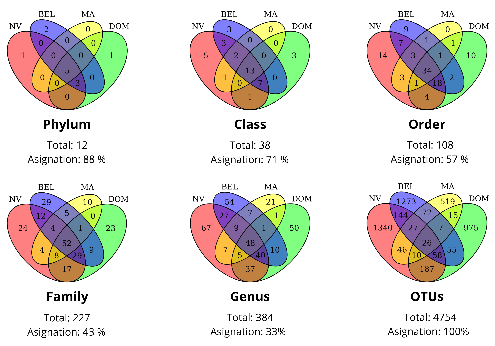
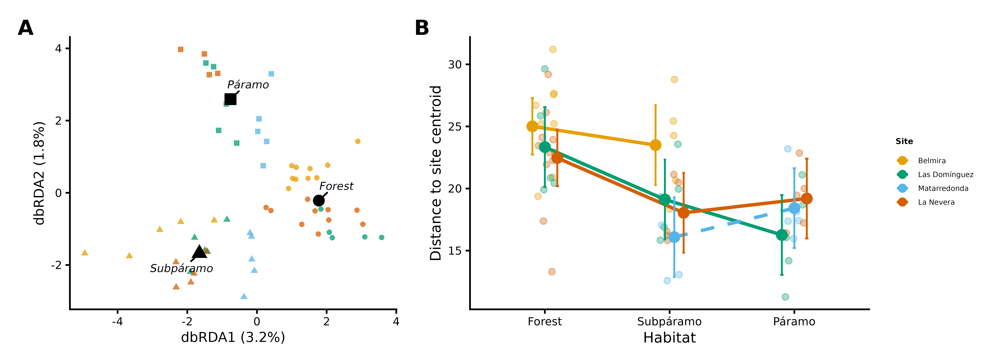
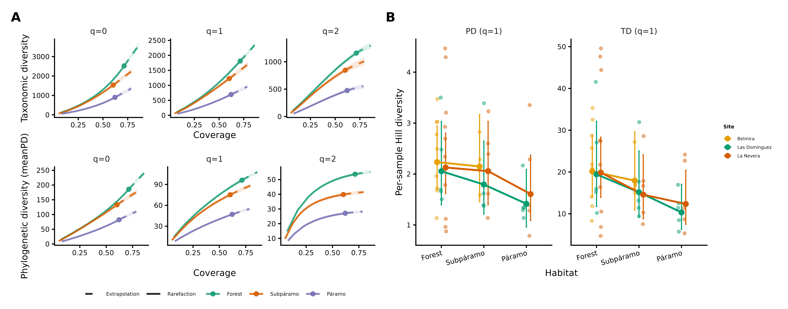
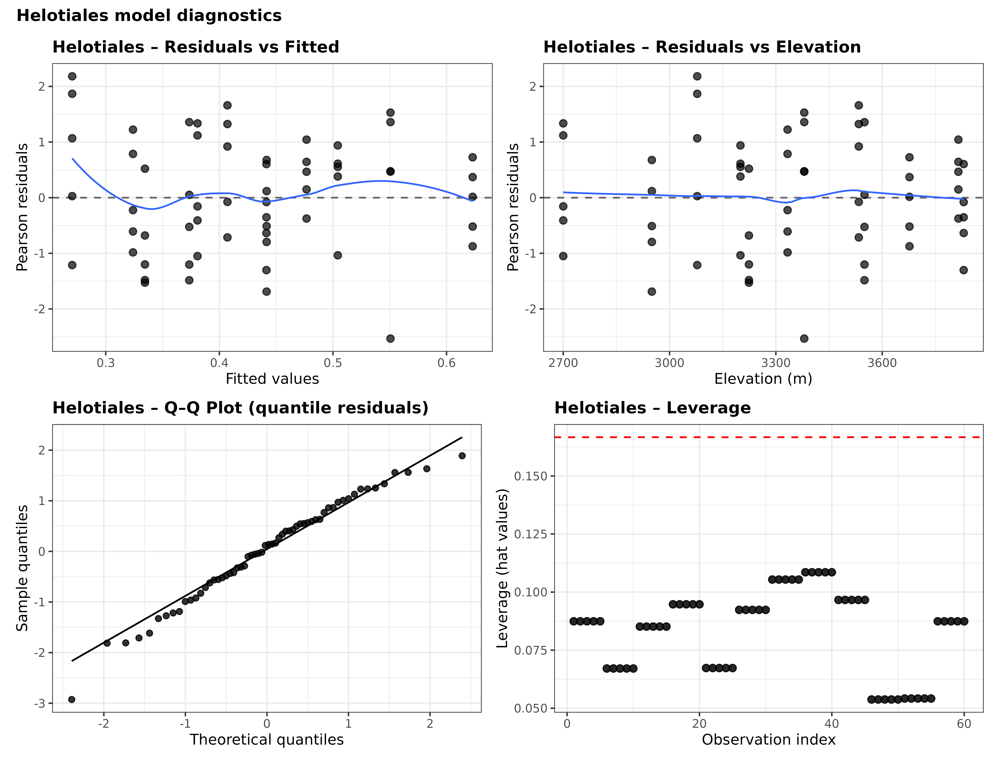
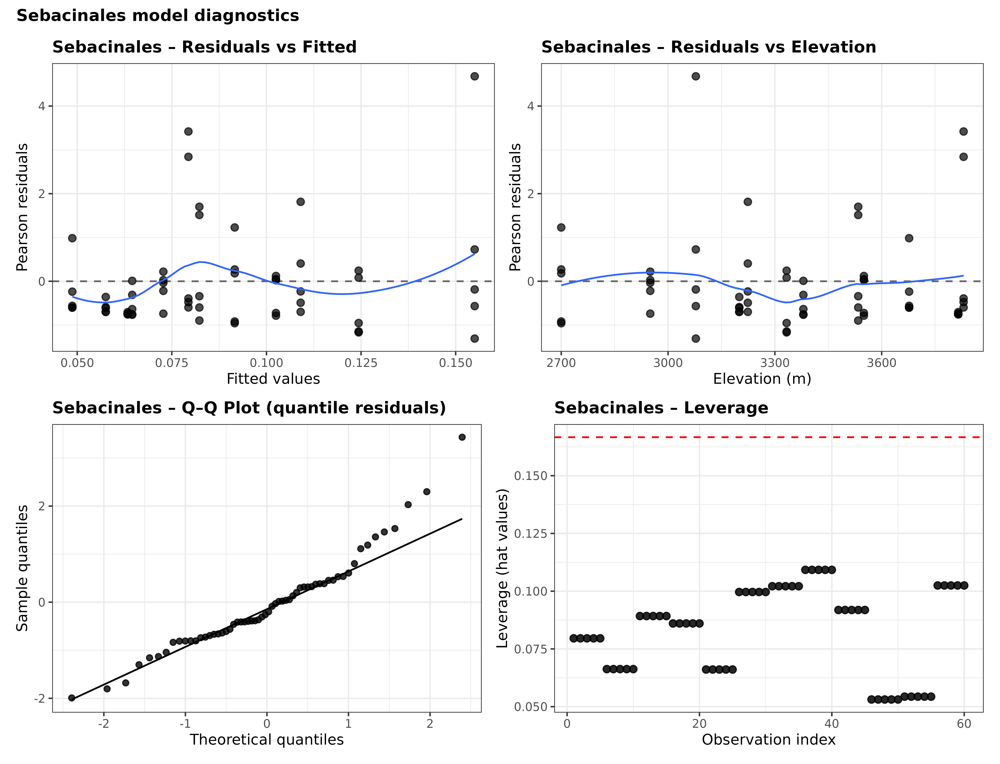
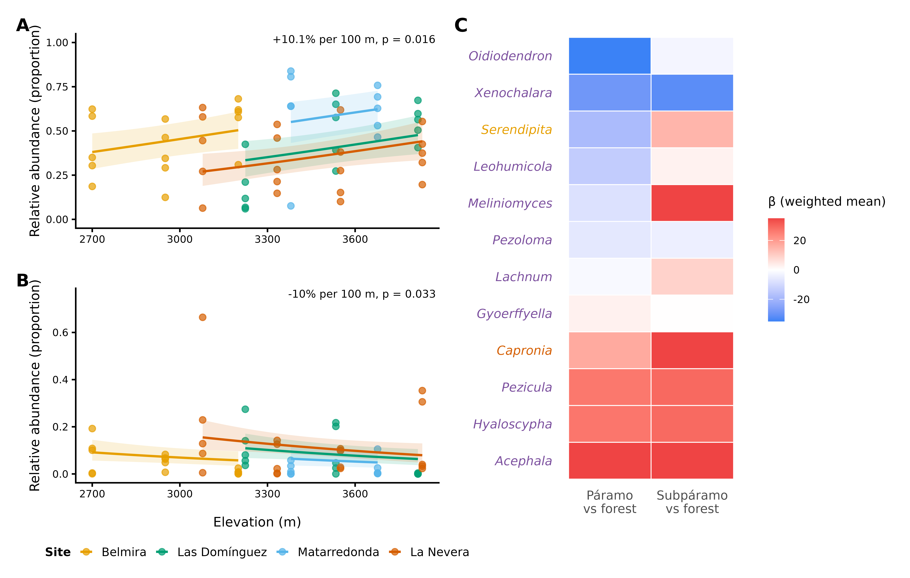
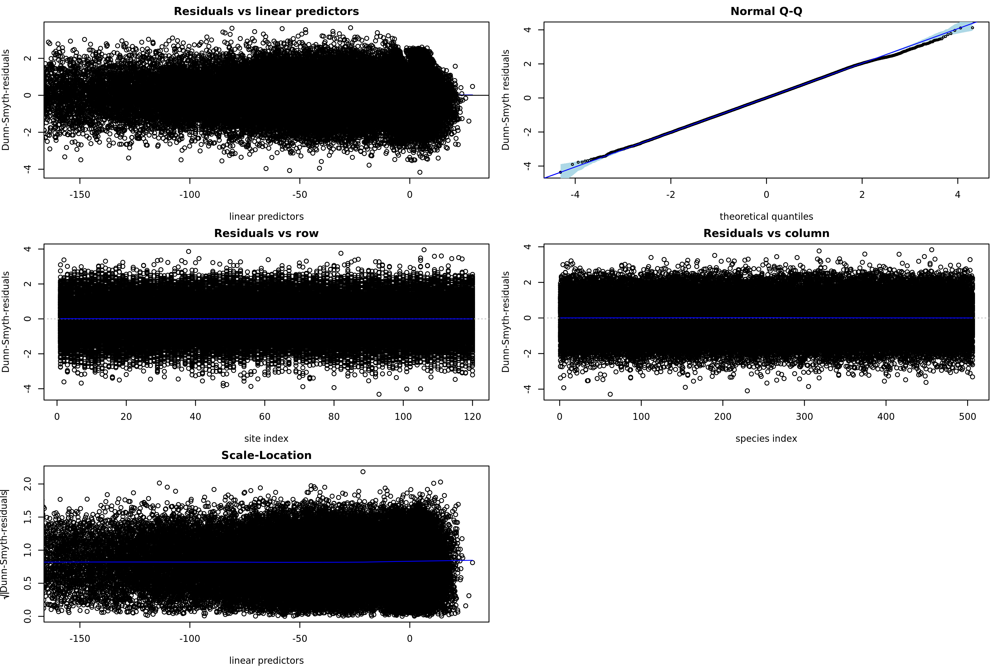
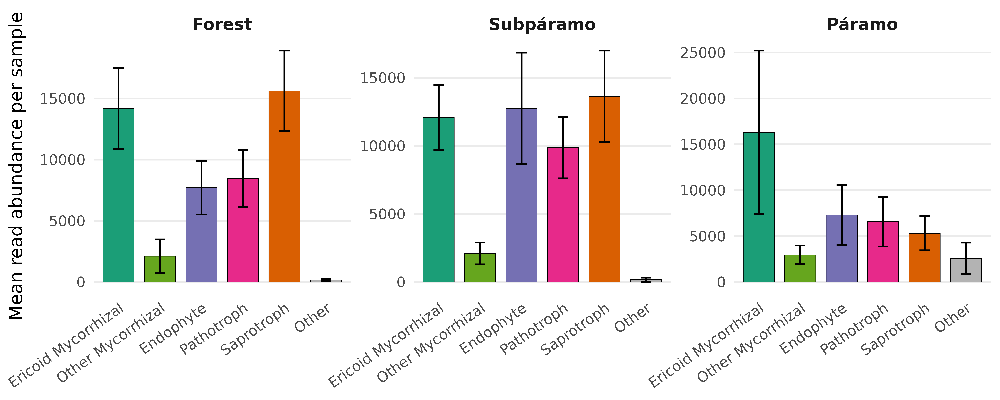
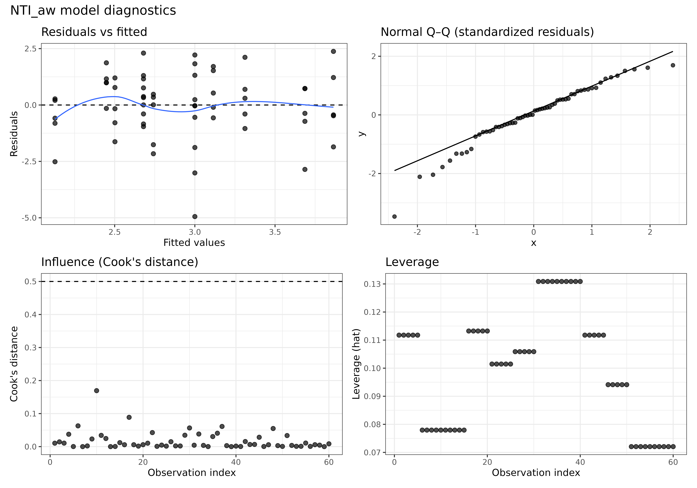
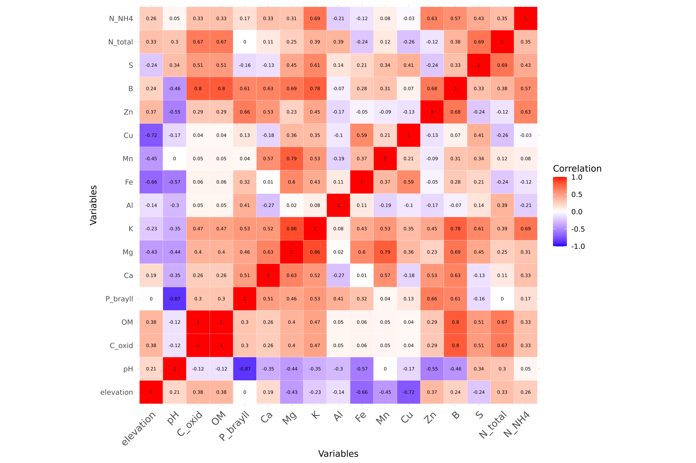

## Overview and reproducibility

This document compiles methodological details, supplementary analyses, and reproducibility outputs supporting the main manuscript. Computationally intensive steps (e.g. phylogenetic tree inference, GLLVM fitting, iNEXT3D diversity estimation) were executed on a remote Ubuntu-based computing environment. Their outputs (figures, tables, and selected model objects) are integrated here as static results.

All figures (PNG) and result tables (CSV) are stored within the project repository using relative paths. Rendering this document therefore requires cloning the repository and opening the .qmd file from the repository root.

**Data availability.**

Repository: [Root_fungi_DADA2](https://github.com/Ssangulo/Root_fungi_DADA2)\
Sequence data: ENA accession number PRJEB107725\
Metadata: `Data_S1_metadata.csv, Data_S3_soil.csv`

------------------------------------------------------------------------

## Section 0: Setup {.unnumbered}

Output directory paths and shared aesthetic constants used throughout this document. All packages are loaded locally within each code section.

```{r setup}
#| eval: false
#| echo: true
#| code-fold: true

# Output folders used by table/figure chunks
out_fig_dir <- "figures"
out_tab_dir <- "tables"
out_obj_dir <- "objects"

# Shared colorblind-safe palette (Wong 2011) — used in all main figures
site_colors <- c(BEL = "#E69F00", DOM = "#009E73", MA = "#56B4E9", NV = "#D55E00")
site_labels <- c(BEL = "Belmira", DOM = "Las Domínguez", MA = "Matarredonda", NV = "La Nevera")

# Habitat colors (Dark2)
habitat_colors <- c("Forest" = "#1b9e77", "Subpáramo" = "#d95f02", "Páramo" = "#7570b3")

# Shared base theme — all main figures use theme_classic(base_size = 11)
# (Defined per-chunk as base_theme; replicated here for reference)
# base_theme <- theme_classic(base_size = 11) + theme(...)

# Habitat label mapping (lowercase raw → display)
labs_map  <- c(forest = "Forest", subparamo = "Subpáramo", paramo = "Páramo")
lvl_order <- c("Forest", "Subpáramo", "Páramo")
```

------------------------------------------------------------------------

## Section 1: Data and object loading {.unnumbered}

All pre-computed R objects are loaded here. Computationally intensive analyses (GLLVM, iNEXT3D, NTI/NRI, phylogeny inference) were executed on a remote server; their outputs are stored in `objects/` and loaded as needed.

```{r load-objects}
#| eval: false
#| echo: true
#| code-fold: true

# Main analysis phyloseq object (root-only; replicates collapsed; soil reads removed; decontam applied)
ps_individual <- readRDS(file.path(out_obj_dir, "ps_individual.rds"))

# Phyloseq object with phylogenetic tree (two root replicates kept separate)
tree_ps <- readRDS(file.path(out_obj_dir, "tree_ps.rds"))

# GLLVM heatmap plot object (generated by scripts/gllvm_analysis.R)
# GLLVM model object fit_nb_2  too large to upload
p_heat <- readRDS(file.path(out_obj_dir, "p_heat.rds"))

```

## Section 2: Bioinformatics summary and study design

### 2.1 Study sites and sampling

This study was conducted across four humid páramo regions in the Colombian Andes, spanning the Central and Eastern Cordilleras. Sampling locations covered elevations from 2,715 to 3,828 m a.s.l., representing the ecological transition from Andean forest to páramo (see main text, Fig. 1). The full sample metadata table is provided in Data_S1_metadata.csv.

Root sampling followed standardized sterile procedures. Fine roots of Gaultheria myrsinoides were excavated using a spade, and 3–5 cm root tips were clipped using a sterilized pruner. Tools were disinfected with 75% ethanol between samples, and gloves were changed between individual plants to minimize contamination. Root fragments were placed into sealed polybags stored in ice-cooled containers in the field. Samples were processed at Universidad ICESI, where roots were rinsed in sterile water to remove debris, dried briefly under a laminar flow hood, and stored at –20°C prior to shipment to Norway, and long-term storage at –80°C. Soil samples (top 15 cm) were collected at each sampling location, and five aliquots of rinse water were retained as laboratory and transport controls.

**Table S1**: GPS coordinates, elevation, and vegetation type classification of the 12 sampling locations across four páramo regions. These sites span the forest–subpáramo–páramo gradient and were used for root and soil sampling. In each location, 10 root samples were collected from 5 individuals (2 root samples per individual) and 1 soil sample.

|             |                      |                  |                  |                   |               |
|------------|------------|------------|------------|------------|------------|
| **Site ID** | **Site**             | **Altitude (m)** | **Latitude (N)** | **Longitude (W)** | **Ecosystem** |
| NV_1        | Páramo La Nevera     | 3828             | 03º30’58.1”      | 076º03’05.4”      | Páramo        |
| NV_2        | Páramo La Nevera     | 3550             | 03º31’37.7”      | 076º03’38.7”      | Subpáramo     |
| NV_3        | Páramo La Nevera     | 3333             | 03º32’07.0”      | 076º04’18.3”      | Andean forest |
| NV_4        | Páramo La Nevera     | 3078             | 03º32’48.9”      | 076º04’31.3”      | Andean forest |
| DOM_1       | Páramo Las Domínguez | 3815             | 03º43’51.8”      | 076º06’38.1”      | Páramo        |
| DOM_2       | Páramo Las Domínguez | 3534             | 03º44’07.2”      | 076º05’53.2”      | Subpáramo     |
| DOM_3       | Páramo Las Domínguez | 3234             | 03º44’17.1”      | 076º05’32.9”      | Andean forest |
| BEL_1       | Páramo Belmira       | 3254             | 06º38’43.8”      | 075º40’13.3”      | Subpáramo     |
| BEL_2       | Páramo Belmira       | 2950             | 06º38’22.7”      | 075º39’57.3”      | Andean forest |
| BEL_3       | Páramo Belmira       | 2715             | 06°36'55.3"      | 075°39'51.1"      | Andean forest |
| MA_1        | Páramo Matarredonda  | 3678             | 04º33’31.5”      | 074º01’43.8”      | Páramo        |
| MA_2        | Páramo Matarredonda  | 3381             | 04º33’10.3”      | 073º59’35.3”      | Subpáramo     |

### 2.2 Read filtering, OTU table, and taxonomic assignment

This section provides supplementary details on sequencing read processing and quality filtering. The full bioinformatic pipeline (including DADA2 processing and replicate filtering) is available in the repository at "/Scripts/full_pipeline_DADA2.R". Here we report summary tables of read retention and replicate-filtering thresholds used for downstream analyses.

**Table S2**: Median read numbers per PCR replicate for environmental samples (root and soil samples) and controls (blank extractions, positive, PCR blank, and tag-jump controls). The read counts are grouped at each stage of the DADA2 pipeline. Blank extraction controls (not containing any biological sample) were performed alongside real sample DNA extractions per each extraction batch. PCR blank controls contained all PCR reagents but no DNA template. Tag-jump controls are PCR reactions containing no primers and no DNA template, used to detect tag-jumping (index hopping). 

|                               |               |              |                         |                     |                           |
|------------|------------|------------|------------|------------|------------|
|                               | **Raw reads** | **Filtered** | **Merged - Non pooled** | **Merged - Pooled** | **Merged - Pseudopooled** |
| **Root samples**              | 77,047        | 71,783       | 71,084                  | 70,343              | 71,242                    |
| **Soil samples**              | 72,158        | 66,555       | 65,311                  | 65,498              | 65,385                    |
| **Blank Extraction Controls** | 2,844         | 2,652        | 2,618                   | 2,566               | 2,625                     |
| **Positive Controls**         | 95,238        | 88,174       | 88,062                  | 87,996              | 87,972                    |
| **PCR Blank Controls**        | 291           | 261          | 250                     | 257                 | 256                       |
| **Tag-jump Controls**         | 41            | 36           | 27                      | 30                  | 32                        |

------------------------------------------------------------------------

```{r}
#| echo: false
library(knitr)

tab_s3 <- read.csv("tables/Table_S3_OTU_filtering_summary.csv", check.names = FALSE)

kable(
  tab_s3,
  caption = "Table S3. Number of OTUs and samples after applying different replicate control filtering thresholds. The table shows results for both soil and root samples combined and only root samples."
)
```

------------------------------------------------------------------------

**Table S4**: Summary of the percentage of reads and OTUS with confident taxonomic assignment at each taxonomic rank, represented by habitat. Percentages were calculated from the filtered root-only dataset (soil reads removed).

|          |             |                       |                      |
|----------|-------------|-----------------------|----------------------|
| **Rank** | **Habitat** | **%\_reads_assigned** | **%\_otus_assigned** |
| Phylum   | Forest      | 88,1                  | 88,1                 |
| Phylum   | Subpáramo   | 91,6                  | 88,6                 |
| Phylum   | Páramo      | 92,9                  | 89,3                 |
| Class    | Forest      | 78,3                  | 72,5                 |
| Class    | Subpáramo   | 84,2                  | 72,3                 |
| Class    | Páramo      | 84,3                  | 76,0                 |
| Order    | Forest      | 68,3                  | 59,2                 |
| Order    | Subpáramo   | 74,2                  | 57,1                 |
| Order    | Páramo      | 78,2                  | 60,9                 |
| Genus    | Forest      | 32,8                  | 34,2                 |
| Genus    | Subpáramo   | 32,1                  | 32,2                 |
| Genus    | Páramo      | 31,4                  | 32,7                 |

## Section 3: Taxonomic overview



**Figure S1**: Venn diagram of taxonomic assignments across sampling sites, in the root only dataset, but previous to soil sequences removal. Venn diagrams illustrate the overlap of OTU taxonomic assignments across four study sites: La Nevera (NV), Las Domínguez (DOM), Belmira (BEL), and Matarredonda (MA). Only OTUs with confirmed assignments at each taxonomic level are included.

------------------------------------------------------------------------


**Figure S2**: Taxonomic composition in root samples along the elevational gradient. Relative read abundances are shown at three taxonomic ranks:  A) Phylum, B) Genus and C) Order. Each bar represents an individual root sample, grouped by habitat: Forest (2700-3300 m), Subpáramo (3300-3500 m), and Páramo (3800 m). Study sites are indicated on the y-axis.

------------------------------------------------------------------------


**Figure S3**: Taxonomic composition in soil samples, collected at each of the sampling locations. Relative read abundances are shown at three taxonomic ranks:  A) Phylum, B) Genus, and C) Order. Each bar represents an individual soil sample, grouped by habitat: Forest (2700-3300 m), Subpáramo (3300-3500 m), and Páramo (3800 m). Study sites are indicated on the y-axis.

```{r}
#| eval: false
#| echo: true
#| code-fold: true
#| code-summary: "MicroViz code for taxonomic barplots (executed on server)"

# MicroViz taxonomic barplots
# Code executed on remote server; plots saved as PNG and embedded above.

library(microViz)

filter_taxa_by_rank <- function(physeq_obj, rank_prefix = "o__", exclude_term = "Incertae_sedis") {
  taxa_assigned <- grepl(rank_prefix, tax_table(physeq_obj)[, "Order"])
  exclude_incertae_sedis <- !grepl(exclude_term, tax_table(physeq_obj)[, "Order"])
  taxa_filtered <- taxa_assigned & exclude_incertae_sedis
  physeq_filtered <- prune_taxa(taxa_filtered, physeq_obj)
  return(physeq_filtered)
}

ps_filtered <- filter_taxa_by_rank(alldat.N[[2]])

# Clean taxonomic prefixes like o__, g__, etc.
tax_table(ps_filtered) <- apply(
  tax_table(ps_filtered), 2, function(x) gsub("^[a-z]__", "", x)
)

# Recode habitat labels
sample_data(ps_filtered)$habitat <- dplyr::recode(
  as.character(sample_data(ps_filtered)$habitat),
  "forest"    = "Forest",
  "subparamo" = "Subpáramo",
  "paramo"    = "Páramo",
  .default = NA_character_
)


# Order the factor levels
sample_data(ps_filtered)$habitat <- factor(
  sample_data(ps_filtered)$habitat,
  levels = c("Forest","Subpáramo","Páramo"),
  ordered = TRUE
)

ps_filtered <- ps_filtered %>% ps_arrange(site)

#  within each site, order samples by Bray/OLO seriation at Order level ---
site_levels <- sample_data(ps_filtered) %>% as.data.frame() %>% pull(site) %>% unique()

samp_order <- unlist(lapply(site_levels, function(s) {
  ps_filtered %>%
    ps_filter(site == s) %>%
    ps_seriate(rank = "Order") %>%   # same tax_level you plot
    sample_names()                   # returns samples in seriated order
}))

# Barplot faceted by habitat, clean legend labels
p <- ps_filtered %>%
  comp_barplot(
    tax_level = "Order", n_taxa = 10, label = "site",
    bar_outline_colour = "grey5", facet_by = "habitat", sample_order = samp_order,   
    merge_other = FALSE, other_name = "Other orders"
  ) +
  coord_flip() +
  theme(
    legend.text  = element_text(size = 6),
    legend.title = element_text(size = 7),
    legend.key.size = unit(0.3, "cm"),
    legend.spacing.x = unit(0.2, "cm"),
    plot.title = element_text(hjust = 0.5)
  )


#Plot for phylum
phy <- ps_filtered %>%
  comp_barplot(
    tax_level = "Phylum", n_taxa = 5, label = "site",
    bar_outline_colour = "grey5", facet_by = "habitat", sample_order = samp_order,   
    merge_other = FALSE, other_name = "Other phyla"
  ) +
  coord_flip() +
  theme(
    legend.text  = element_text(size = 6),
    legend.title = element_text(size = 7),
    legend.key.size = unit(0.3, "cm"),
    legend.spacing.x = unit(0.2, "cm"),
    plot.title = element_text(hjust = 0.5)
  )


#Plot for class
class <- ps_filtered %>%
  comp_barplot(
    tax_level = "Class", n_taxa = 10, label = "site",
    bar_outline_colour = "grey5", facet_by = "habitat", sample_order = samp_order,   
    merge_other = FALSE, other_name = "Other classes"
  ) +
  coord_flip() +
  theme(
    legend.text  = element_text(size = 6),
    legend.title = element_text(size = 7),
    legend.key.size = unit(0.3, "cm"),
    legend.spacing.x = unit(0.2, "cm"),
    plot.title = element_text(hjust = 0.5)
  )


#Plot for genus
genus <- ps_filtered %>%
  comp_barplot(
    tax_level = "Genus", n_taxa = 20, label = "site",
    bar_outline_colour = "grey5", facet_by = "habitat", sample_order = samp_order,   
    merge_other = FALSE, other_name = "Other genera"
  ) +
  coord_flip() +
  theme(
    legend.text  = element_text(size = 6),
    legend.title = element_text(size = 7),
    legend.key.size = unit(0.3, "cm"),
    legend.spacing.x = unit(0.2, "cm"),
    plot.title = element_text(hjust = 0.5)
  )


```

## Section 4: Community composition {.page-break-before}

This section provides detailed statistical analyses supporting the patterns of root-associated fungal community composition described in the main text. Several of these analyses form the basis of results reported in the main manuscript; here we document the full model specifications and test statistics to ensure transparency and reproducibility.

We include distance-based redundancy analysis (dbRDA) based on robust Aitchison distances to assess habitat-associated compositional structure while conditioning on site. We further present PERMANOVA results from a balanced subset of samples (NV–DOM) used to test habitat and site effects under a controlled sampling design. In addition, we report a centroid-based turnover model quantifying the magnitude of community change across habitats using the full dataset.

### 4.1 dbRDA ordination (Tables S5–S6)

Distance-based redundancy analysis (dbRDA) was conducted on robust Aitchison distances to test for habitat-associated compositional structure while conditioning on site. This analysis is reported in the main manuscript as Figure 2A (habitat separation conditioned on site; permutation test $F=1.41$, $p=0.001$).

------------------------------------------------------------------------

```{r}
#| echo: false
library(knitr)

tab_terms <- read.csv("tables/Table_S5_dbRDA_terms.csv")
kable(tab_terms, digits = 3,
      caption = "Table S5. dbRDA permutation tests (by term; 999 permutations).")
```

```{r}
#| echo: false
tab_axis <- read.csv("tables/Table_S6_dbRDA_axes.csv")
kable(tab_axis, digits = 3,
      caption = "Table S6. dbRDA permutation tests (by constrained axis; 999 permutations).")
```

```{r}
#| eval: false
#| echo: true
#| code-fold: true
#| code-summary: "Code used to generate Tables S5–S6 and dbRDA support plot (executed on server)"

#Running dbRDA with robust aitchison
library(phyloseq)
library(vegan)
library(ggplot2)
library(knitr)


ps <- ps_individual #phyloseq object

X <- as(otu_table(ps), "matrix")
if (taxa_are_rows(ps)) X <- t(X)

sam <- data.frame(sample_data(ps))
sam$habitat <- factor(sam$habitat)
sam$site    <- factor(sam$site)


# dbRDA model: habitat constrained, conditioning on site
d_ait <- vegdist(otu_table(ps), binary=FALSE, method="robust.aitchison")
mod_ait <- capscale(d_ait ~ habitat + Condition(site), data = sam)

# Permutation tests (999 permutations)
set.seed(1)
a_terms   <- anova.cca(mod_ait, by = "terms", permutations = 999)
a_axis    <- anova.cca(mod_ait, by = "axis", permutations = 999)


a_terms
a_axis

tab_terms <- data.frame(
  Term = rownames(a_terms),
  Df = a_terms$Df,
  Variance = a_terms$Variance,
  F = a_terms$F,
  Pr = a_terms$`Pr(>F)`,
  row.names = NULL
)

tab_axis <- data.frame(
  Axis = rownames(a_axis),
  Df = a_axis$Df,
  Variance = a_axis$Variance,
  F = a_axis$F,
  Pr = a_axis$`Pr(>F)`,
  row.names = NULL
)

write.csv(tab_terms, file.path(out_tab_dir, "Table_S5_dbRDA_terms.csv"), row.names = FALSE)
write.csv(tab_axis,  file.path(out_tab_dir, "Table_S6_dbRDA_axes.csv"),  row.names = FALSE)


# Plotting Figure 2A support panel 
eig <- mod_ait$CCA$eig
cap1_pct <- round(100 * eig[1] / sum(eig), 1)
cap2_pct <- round(100 * eig[2] / sum(eig), 1)

cols <- c(forest="steelblue", subparamo="seagreen3", paramo="firebrick")

png("Figure2A_dbRDA_support.png", width=7.2, height=6.2, units="in", res=600)
par(mar=c(4.5,4.5,1,1))
plot(mod_ait, display="sites", type="n",
     xlab=paste0("dbRDA1 (",cap1_pct,"%)"),
     ylab=paste0("dbRDA2 (",cap2_pct,"%)"))
pts <- scores(mod_ait, display="sites")
points(pts, pch=16, cex=0.7, col=cols[as.character(sam$habitat)])
legend("topright", bty="n", legend=levels(sam$habitat),
       col=cols[levels(sam$habitat)], pch=16, pt.cex=0.9)
dev.off()

```

### 4.2 PERMANOVA and beta-dispersion (Tables S7–S9)

Beta-dispersion tests indicated higher within-habitat variability in forests compared with subpáramo and páramo communities (p \< 0.001), whereas dispersion did not differ among sites (p = 0.526). Because the PERMANOVA was conducted on a balanced subset of samples, the significant effects of habitat, site, and their interaction are interpreted as reflecting genuine compositional differences rather than artifacts of unequal dispersion.

```{r}
#| echo: false
library(knitr)

tab_s7 <- read.csv("tables/Table_S7_PERMANOVA.csv")
kable(tab_s7, digits = 3, caption = "Table S7. PERMANOVA (adonis2) results by term.")
```

```{r}
#| echo: false
disp_hab <- read.csv("tables/Table_S8_dispersion_habitat.csv")
test_hab <- read.csv("tables/Table_S8_betadisper_test_habitat.csv")

kable(disp_hab, digits = 3,
      caption = paste0("Table S8. Habitat beta-dispersion (distance to centroid). Permutation test p = ",
                       signif(test_hab$p_value[1], 3), "."))
```

```{r}
#| echo: false
test_site <- read.csv("tables/Table_S9_betadisper_test_site.csv")

kable(test_site, digits = 3,
      caption = "Table S9. Site beta-dispersion permutation test.")
```

```{r}
#| eval: false
#| echo: true
#| code-fold: true
#| code-summary: "Code used to generate Tables S7–S9 (executed on server)"

ps <- ps_individual #phyloseq obj

# Balanced subset: NV + DOM, remove NV_4
balanced_ps <- subset_samples(ps, site %in% c("DOM", "NV"))
balanced_ps <- subset_samples(balanced_ps, site_elevation != "NV_4")
balanced_ps <- prune_taxa(taxa_sums(balanced_ps) > 0, balanced_ps)

# Ensure samples are rows
X <- as(otu_table(balanced_ps), "matrix")
if (taxa_are_rows(balanced_ps)) X <- t(X)

sampledf <- data.frame(sample_data(balanced_ps))
sampledf$site    <- factor(sampledf$site)
sampledf$habitat <- factor(sampledf$habitat)

# Robust Aitchison distance
dists <- vegdist(X, method = "robust.aitchison")

# PERMANOVA (by terms)
set.seed(1)
perma <- adonis2(dists ~ site * habitat, by = "terms", data = sampledf, permutations = 999)

# Convert output to a clean CSV table
tab_perma <- data.frame(
  Source   = rownames(perma),
  df       = perma$Df,
  SumOfSqs = perma$SumOfSqs,
  R2       = perma$R2,
  `Pseudo-F` = perma$F,
  `Pr(>F)` = perma$`Pr(>F)`,
  row.names = NULL
)

# Beta-dispersion (habitat & site)
bd_hab  <- betadisper(dists, sampledf$habitat)
bd_site <- betadisper(dists, sampledf$site)

set.seed(1)
pt_hab  <- permutest(bd_hab,  permutations = 999)
pt_site <- permutest(bd_site, permutations = 999)

# Group dispersions 
disp_hab <- data.frame(
  habitat = names(bd_hab$group.distances),
  avg_distance_to_centroid = as.numeric(bd_hab$group.distances),
  row.names = NULL
)

disp_site <- data.frame(
  site = names(bd_site$group.distances),
  avg_distance_to_centroid = as.numeric(bd_site$group.distances),
  row.names = NULL
)


test_hab <- data.frame(
  test = "betadisper_habitat",
  permutations = 999,
  F = unname(pt_hab$tab[1, "F"]),
  p_value = unname(pt_hab$tab[1, "Pr(>F)"])
)

test_site <- data.frame(
  test = "betadisper_site",
  permutations = 999,
  F = unname(pt_site$tab[1, "F"]),
  p_value = unname(pt_site$tab[1, "Pr(>F)"])
)

write.csv(tab_perma,  file.path(out_tab_dir, "Table_S7_PERMANOVA.csv"), row.names = FALSE)
write.csv(disp_hab,   file.path(out_tab_dir, "Table_S8_dispersion_habitat.csv"), row.names = FALSE)
write.csv(disp_site,  file.path(out_tab_dir, "Table_S9_dispersion_site.csv"), row.names = FALSE)
write.csv(test_hab,   file.path(out_tab_dir, "Table_S8_betadisper_test_habitat.csv"), row.names = FALSE)
write.csv(test_site,  file.path(out_tab_dir, "Table_S9_betadisper_test_site.csv"), row.names = FALSE)


```

### 4.3 Centroid-based turnover model (Table S10)

To quantify the magnitude of community turnover across habitats while accounting for spatial structure, we calculated the Aitchison distance of each sample to its site-specific centroid and modelled turnover as a function of habitat, site, and their interaction. Habitat had a strong effect on turnover magnitude, whereas the habitat × site interaction was not significant, indicating consistent habitat-associated turnover across geographically isolated páramo regions (Table S10).

Panel B in the main manuscript Figure 2 summarizes this model (habitat $F_{2,50}=14.7$, $p<0.001$; habitat × site $F_{4,50}=1.28$, $p=0.29$), with Matarredonda (MA) shown as a dashed trend due to a compressed gradient.

```{r}
#| echo: false
library(knitr)

tab_s10 <- read.csv("tables/Table_S10_centroid_model.csv")
kable(tab_s10, digits = 3,
      caption = "Table S10. Linear model results for centroid-based turnover.")

```

```{r}
#| eval: false
#| echo: true
#| code-fold: true
#| code-summary: "Code used to generate Table S10 (executed on server)"

library(phyloseq)
library(vegan)
library(ggplot2)


ps <- ps_individual #phyloseq obj


# OTU table -> samples x taxa
X <- as(otu_table(ps), "matrix")
if (taxa_are_rows(ps)) X <- t(X)
X <- as.matrix(X)

# Robust CLR
rfy <- decostand(X, "rclr", MARGIN = 1)

# Metadata
meta <- data.frame(sample_data(ps), check.names = FALSE, stringsAsFactors = FALSE)
stopifnot(identical(rownames(rfy), rownames(meta)))

# Site centroids in CLR space
centroids <- rowsum(rfy, group = meta$site) / as.vector(table(meta$site))

# Euclidean distance to site centroid
euclid <- function(x, y) sqrt(sum((x - y)^2))

dist_centroid <- vapply(
  seq_len(nrow(rfy)),
  function(i) euclid(rfy[i, ], centroids[meta$site[i], ]),
  numeric(1)
)

# Model dataframe
df <- meta
df$dist_centroid <- dist_centroid
df$site <- factor(df$site)
df$habitat <- factor(df$habitat, levels = c("forest", "subparamo", "paramo"))

# Linear model (habitat-based)
mod_hab <- lm(dist_centroid ~ habitat * site, data = df)

# ANOVA table
a <- anova(mod_hab)

tab_s10 <- data.frame(
  Effect = rownames(a),
  df = a$Df,
  `Sum of Squares` = a$`Sum Sq`,
  `Mean Square` = a$`Mean Sq`,
  `F value` = a$`F value`,
  `p value` = a$`Pr(>F)`,
  row.names = NULL
)

# Plot centroid-based turnover: raw points + model-estimated means (95% CI)
# Use only observed habitat-site combinations to avoid non-estimable cases.
pred <- unique(df[, c("habitat", "site")])
pred$habitat <- factor(pred$habitat, levels = levels(df$habitat))
pred$site <- factor(pred$site, levels = levels(df$site))
pred <- pred[order(pred$site, pred$habitat), , drop = FALSE]

pred_fit <- predict(mod_hab, newdata = pred, se.fit = TRUE)
pred$fit <- pred_fit$fit
pred$se <- pred_fit$se.fit
t_crit <- qt(0.975, df = df.residual(mod_hab))
pred$lower <- pred$fit - t_crit * pred$se
pred$upper <- pred$fit + t_crit * pred$se

dodge <- position_dodge(width = 0.25)

p_turnover <- ggplot(df, aes(x = habitat, y = dist_centroid, color = site)) +
  geom_errorbar(
    data = pred,
    aes(x = habitat, ymin = lower, ymax = upper, color = site, group = site),
    width = 0.1,
    linewidth = 0.6,
    position = dodge,
    inherit.aes = FALSE
  ) +
  geom_line(
    data = pred,
    aes(x = habitat, y = fit, color = site, group = site),
    linewidth = 1,
    position = dodge,
    inherit.aes = FALSE
  ) +
  geom_point(
    data = pred,
    aes(x = habitat, y = fit, color = site, group = site),
    size = 2.3,
    position = dodge,
    inherit.aes = FALSE
  ) +
  labs(
    x = "Habitat",
    y = "Distance to site centroid (Aitchison CLR space)",
    color = "Site"
  ) +
  theme_bw(base_size = 11)

p_turnover

# export
ggsave(
  filename = file.path(out_fig_dir, "Figure2B_centroid_turnover_support.png"),
  plot = p_turnover,
  width = 8.5,
  height = 5,
  dpi = 900,
  bg = "white"
)

write.csv(tab_s10, file.path(out_tab_dir, "Table_S10_centroid_model.csv"), row.names = FALSE)

```

```{r fig2_dbrda_centroid}
#| eval: false
#| echo: true
#| code-fold: true
#| code-summary: "Code used to generate Figure 2 (dbRDA + centroid turnover, executed on server)"

# =============================================================================
# Figure 2: Community composition (dbRDA) + Centroid-based turnover model
# Two-panel publication figure for Molecular Ecology submission
# =============================================================================

library(ggplot2)
library(patchwork)
library(ggrepel)
library(dplyr)

# -----------------------------------------------------------------------------
# SHARED AESTHETICS
# -----------------------------------------------------------------------------

# Colorblind-safe palette (Wong 2011)
site_colors <- c(
  BEL = "#E69F00",
  DOM = "#009E73",
  MA  = "#56B4E9",
  NV  = "#D55E00"
)

site_labels <- c(
  BEL = "Belmira",
  DOM = "Las Domínguez",
  MA  = "Matarredonda",
  NV  = "La Nevera"
)

base_theme <- theme_classic(base_size = 11) +
  theme(
    axis.title      = element_text(size = 9),
    axis.text       = element_text(size = 7, color = "black"),
    legend.title    = element_text(size = 5, face = "bold"),
    legend.text     = element_text(size = 4.5),
    legend.key.size = unit(0.6, "lines"),
    legend.position = "right",
    plot.tag        = element_text(size = 13, face = "bold"),
    strip.background = element_blank()
  )

# -----------------------------------------------------------------------------
# PANEL A: dbRDA ordination
# Uses mod_ait (capscale object) and sam (metadata) from the dbRDA section
# -----------------------------------------------------------------------------

scores_sites <- as.data.frame(scores(mod_ait, display = "sites", choices = 1:2))
scores_sites$SampleID <- rownames(scores_sites)

meta_join <- data.frame(
  SampleID = rownames(sam),
  site     = as.character(sam$site),
  habitat  = as.character(sam$habitat),
  stringsAsFactors = FALSE
)

scores_sites <- scores_sites %>%
  left_join(meta_join, by = "SampleID")

# Recode habitat labels and add accent to Subpáramo/Páramo
scores_sites$habitat <- factor(
  scores_sites$habitat,
  levels = c("Forest", "Subparamo", "Paramo"),
  labels = c("Forest", "Subpáramo", "Páramo")
)
scores_sites$site <- factor(scores_sites$site, levels = names(site_colors))

# Variance explained
eig      <- eigenvals(mod_ait)
prop_exp <- eig / sum(eig[eig > 0])
cap1_pct <- round(prop_exp["CAP1"] * 100, 1)
cap2_pct <- round(prop_exp["CAP2"] * 100, 1)

hab_centroids <- scores_sites %>%
  group_by(habitat) %>%
  summarise(CAP1 = mean(CAP1), CAP2 = mean(CAP2), .groups = "drop")

panel_A <- ggplot(scores_sites, aes(x = CAP1, y = CAP2)) +
  geom_point(
    aes(color = site, shape = habitat),
    size = 1.4, alpha = 0.75, stroke = 0.3
  ) +
  geom_point(
    data = hab_centroids,
    aes(shape = habitat),
    color = "black", size = 2.8, fill = "white", stroke = 1.0
  ) +
  geom_text_repel(
    data        = hab_centroids,
    aes(label   = habitat),
    color       = "black", size = 2.4, fontface = "italic",
    box.padding = 0.4, min.segment.length = 0.2
  ) +
  scale_color_manual(values = site_colors, labels = site_labels, name = "Site") +
  scale_shape_manual(
    values = c("Forest" = 16, "Subpáramo" = 17, "Páramo" = 15),
    name   = "Habitat"
  ) +
  labs(
    x   = paste0("dbRDA1 (", cap1_pct, "%)"),
    y   = paste0("dbRDA2 (", cap2_pct, "%)"),
    tag = "A"
  ) +
  base_theme +
  theme(
    legend.position = "none",
    axis.title      = element_text(size = 8.5)
  )

# -----------------------------------------------------------------------------
# PANEL B: Centroid-based turnover model
# Uses mod_hab and df from the centroid model section
# MA flagged with dashed line (incomplete gradient — no forest baseline)
# -----------------------------------------------------------------------------

pred <- unique(df[, c("habitat", "site")])
pred$habitat <- factor(pred$habitat, levels = c("forest", "subparamo", "paramo"))
pred$site    <- factor(pred$site,    levels = names(site_colors))
pred <- pred[order(pred$site, pred$habitat), , drop = FALSE]

pred_fit   <- predict(mod_hab, newdata = pred, se.fit = TRUE)
pred$fit   <- pred_fit$fit
pred$se    <- pred_fit$se.fit
t_crit     <- qt(0.975, df = df.residual(mod_hab))
pred$lower <- pred$fit - t_crit * pred$se
pred$upper <- pred$fit + t_crit * pred$se

pred$linetype_group <- ifelse(pred$site == "MA", "incomplete", "complete")
df$linetype_group   <- ifelse(df$site   == "MA", "incomplete", "complete")

pred$habitat_lab <- factor(pred$habitat,
  levels = c("forest", "subparamo", "paramo"),
  labels = c("Forest", "Subpáramo", "Páramo"))
df$habitat_lab <- factor(df$habitat,
  levels = c("forest", "subparamo", "paramo"),
  labels = c("Forest", "Subpáramo", "Páramo"))

pred$site_fac <- factor(pred$site, levels = names(site_colors))
df$site_fac   <- factor(df$site,   levels = names(site_colors))

dodge <- position_dodge(width = 0.3)

panel_B <- ggplot() +
  geom_jitter(
    data = df,
    aes(x = habitat_lab, y = dist_centroid, color = site_fac),
    width = 0.08, height = 0, size = 1.6, alpha = 0.35, show.legend = FALSE
  ) +
  geom_line(
    data = pred,
    aes(x = habitat_lab, y = fit, color = site_fac,
        group = site_fac, linetype = linetype_group),
    linewidth = 1.0, position = dodge
  ) +
  geom_errorbar(
    data = pred,
    aes(x = habitat_lab, ymin = lower, ymax = upper,
        color = site_fac, group = site_fac),
    width = 0.08, linewidth = 0.55, position = dodge
  ) +
  geom_point(
    data = pred,
    aes(x = habitat_lab, y = fit, color = site_fac, group = site_fac),
    size = 2.8, position = dodge
  ) +
  scale_color_manual(values = site_colors, labels = site_labels, name = "Site") +
  scale_linetype_manual(
    values = c(complete = "solid", incomplete = "dashed"),
    guide  = "none"
  ) +
  labs(
    x   = "Habitat",
    y   = "Distance to site centroid",
    tag = "B"
  ) +
  base_theme +
  theme(legend.position = "right") +
  guides(color = guide_legend(override.aes = list(size = 2, linewidth = 0.8)))

# -----------------------------------------------------------------------------
# COMBINE with patchwork
# -----------------------------------------------------------------------------

fig2 <- panel_A + panel_B +
  plot_layout(ncol = 2, widths = c(0.9, 1.1), guides = "collect")

ggsave(
  filename = file.path(out_fig_dir, "Figure_2_dbRDA_centroid.png"),
  plot = fig2, width = 17.4, height = 6.3, units = "cm", dpi = 900, bg = "white"
)
```

### 4.4 Figure 2



**Figure 2**: Community composition and turnover across habitats. Panel A: dbRDA ordination of RAF communities conditioned on site (color = site, shape = habitat; permutation $F=1.41$, $p=0.001$). Panel B: centroid-based turnover model (distance to site-specific centroid across habitats), with MA shown as dashed due to incomplete gradient (habitat $F_{2,50}=14.7$, $p<0.001$; habitat × site $F_{4,50}=1.28$, $p=0.29$).

## Section 5: Diversity trajectories {.page-break-before}

Diversity trajectories were assessed using three complementary approaches: per-sample Hill diversity models to test parallelism across sites, iNEXT3D rarefaction/extrapolation curves for habitat-level estimates, and beta-diversity partitioning. All analyses require a rooted phylogenetic tree, inferred below. Analyses are presented in computation order; Figure 3 follows as a composite of pre-computed outputs.

```{r}
#| eval: false
#| echo: true
#| code-fold: true
#| code-summary: "Phylogenetic tree inference (GTR+Γ; executed on server)"

library(DECIPHER)
library(Biostrings)
library(phangorn)
library(phyloseq)

# alldat.N[[2]]: rg2-filtered nopool root object retaining both
# root replicates per plant (120 samples); used for phylogenetic
# tree inference only. Equivalent to rg2.nopoolps before
# per-plant collapsing (ps_individual).
align <- AlignSeqs(DNAStringSet(refseq(alldat.N[[2]])), anchor=NA)

phang_align <- phyDat(as(align, "matrix"), type="DNA")
dm <- dist.ml(phang_align)
treeNJ <- NJ(dm)
fit <- pml(treeNJ, data=phang_align)
fitGTR <- update(fit, k=4, inv=0.2)
fit <- optim.pml(fitGTR, model="GTR", optInv=TRUE, optGamma=TRUE, optNni=FALSE,
                 optBf=TRUE, optQ=TRUE, optEdge=TRUE, optRooted=FALSE,
                 rearrangement = "stochastic", control = pml.control(trace = 0))

tree_data_rg2.N <- merge_phyloseq(alldat.N[[2]], fit$tree)

# Save for downstream use (loaded in Section 1 as tree_ps)
saveRDS(tree_data_rg2.N, file.path(out_obj_dir, "tree_ps.rds"))
```

### 5.1 Per-sample Hill diversity: parallelism models (Tables S18–S19)

To evaluate whether diversity trajectories are parallel across geographically isolated sites, we model diversity as a function of habitat (ordered along elevation), site, and their interaction. The key term is habitat × site: a weak/non-significant interaction with a strong habitat main effect supports broadly parallel trajectories with site-specific baselines.

For this section, diversity is computed independently for each sample using Hill numbers: taxonomic diversity (TD) and phylogenetic diversity (PD) at q = 1 (effective Shannon) as the primary metric. This preserves interpretability, keeps consistency with Hill-number logic, and allows direct sample-level inference on trajectory parallelism.

We use a two-model strategy: (i) a primary habitat-factor model for ecological interpretation, and (ii) a secondary numeric-trend model (ordered habitat steps) to summarize site-specific slopes. Model family is screened first (Gaussian, log-Gaussian, Gamma-log) before final inference.

```{r}
#| echo: false
library(knitr)

tab_s18 <- read.csv("tables/Table_S18_TD_parallelism_anova.csv")

kable(
  tab_s18,
  digits = 3,
  caption = "Table S18. ANOVA table for the log-linear model of per-sample taxonomic diversity (TD; Hill q=1) as a function of habitat, site, and their interaction. Habitat × site interaction F(4,50)=1.52, p=0.21 supports parallel diversity trajectories across sites."
)
```

```{r}
#| echo: false
library(knitr)

tab_s19 <- read.csv("tables/Table_S19_PD_parallelism_anova.csv")

kable(
  tab_s19,
  digits = 3,
  caption = "Table S19. ANOVA table for the log-linear model of per-sample phylogenetic diversity (PD; Hill q=1, meanPD) as a function of habitat, site, and their interaction. Habitat × site interaction F(4,50)=1.22, p=0.31 supports parallel diversity trajectories across sites."
)
```

```{r}
#| eval: false
#| echo: true
#| code-fold: true
#| code-summary: "Per-sample Hill TD/PD: family checks + primary factor model + secondary slope model"

library(phyloseq)
library(dplyr)
library(tidyr)
library(ggplot2)
library(ape)
library(phangorn)
library(hillR)
library(emmeans)

# Inputs
ps_ind  <- ps_individual   # collapsed replicates
ps_tree <- tree_ps         # object that already has phylogeny

stopifnot(inherits(ps_ind, "phyloseq"), inherits(ps_tree, "phyloseq"))
stopifnot(!is.null(phy_tree(ps_tree, errorIfNULL = FALSE)))

# 1) Match taxa between ps_ind and tree_ps tree
taxa_ind  <- taxa_names(ps_ind)
tips_tree <- phy_tree(ps_tree)$tip.label
common_taxa <- intersect(taxa_ind, tips_tree)

# 2) Prune collapsed object to taxa represented in tree and build matching tree
ps_div <- prune_taxa(common_taxa, ps_ind)

tr_ind <- ape::keep.tip(phy_tree(ps_tree), common_taxa)
tr_ind$node.label <- NULL
if (!ape::is.rooted(tr_ind)) tr_ind <- phangorn::midpoint(tr_ind)

# Reorder OTU taxa to match tree tip order (important)
ps_div <- prune_taxa(tr_ind$tip.label, ps_div)
stopifnot(identical(taxa_names(ps_div), tr_ind$tip.label))

# 3) Attach tree to collapsed object
phy_tree(ps_div) <- tr_ind
validObject(ps_div)

meta <- as(sample_data(ps_div), "data.frame")
meta$SampleID <- rownames(meta)
meta$site <- factor(meta$site)
meta$habitat <- factor(
  meta$habitat,
  levels = c("forest", "subparamo", "paramo"),
  ordered = TRUE
)
meta$habitat_num <- as.numeric(meta$habitat)

# OTU matrix as taxa x samples -> comm as samples x taxa
OTU <- as(otu_table(ps_div), "matrix")
if (!taxa_are_rows(ps_div)) OTU <- t(OTU)
comm <- t(OTU)
meta$lib_size <- sample_sums(ps_div)

# Tree/community alignment is already defined above via ps_div + tr_ind
tr2 <- phy_tree(ps_div)
comm2 <- comm[, taxa_names(ps_div), drop = FALSE]

# Alignment checks
stopifnot(identical(colnames(comm2), tr2$tip.label))
stopifnot(!anyDuplicated(colnames(comm2)))

# Compatibility wrappers for hillR argument names across versions
get_hill_taxa <- function(x, qval = 1) {
  out <- tryCatch(hill_taxa(x, q = qval), error = function(e) NULL)
  if (is.null(out)) out <- hill_taxa(x, qvalue = qval)
  as.numeric(out)
}

get_hill_phylo <- function(x, tree, qval = 1) {
  out <- tryCatch(hill_phylo(x, tree = tree, q = qval), error = function(e) NULL)
  if (is.null(out)) out <- tryCatch(hill_phylo(x, tree, q = qval), error = function(e) NULL)
  if (is.null(out)) out <- tryCatch(hill_phylo(x, tree = tree, qvalue = qval), error = function(e) NULL)
  if (is.null(out)) out <- hill_phylo(x, tree, qvalue = qval)
  as.numeric(out)
}

# Primary metrics (q = 1): independent values per sample
meta$TD_q1 <- get_hill_taxa(comm, qval = 1)
meta$PD_q1 <- get_hill_phylo(comm2, tree = tr2, qval = 1)

# Optional sensitivity metrics for supplementary checks (not modeled by default)
meta$TD_q0 <- get_hill_taxa(comm, qval = 0)
meta$TD_q2 <- get_hill_taxa(comm, qval = 2)
meta$PD_q0 <- get_hill_phylo(comm2, tree = tr2, qval = 0)
meta$PD_q2 <- get_hill_phylo(comm2, tree = tr2, qval = 2)

# Ensure tabular class for dplyr/tidyr verbs
meta <- as.data.frame(meta, stringsAsFactors = FALSE)

div_long <- meta %>%
  dplyr::select(SampleID, site, habitat, habitat_num, TD_q1, PD_q1) %>%
  pivot_longer(
    cols = c(TD_q1, PD_q1),
    names_to = "metric",
    values_to = "estimate"
  ) %>%
  dplyr::mutate(metric = dplyr::recode(metric, TD_q1 = "TD (q=1)", PD_q1 = "PD (q=1)"))

# Optional depth sensitivity covariate
if (!"lib_size" %in% names(meta)) {
  meta$lib_size <- as.numeric(sample_sums(ps_div)[meta$SampleID])
}

div_long <- div_long %>%
  dplyr::left_join(meta[, c("SampleID", "lib_size"), drop = FALSE], by = "SampleID")

# ---------- 1) Family screening before final inference ----------
# Candidate families:
#  - gaussian:      estimate ~ ...
#  - lognormal_lm:  log(estimate) ~ ...
#  - gamma_log:     glm(..., family = Gamma(link = "log"))

fit_candidates <- function(dat, rhs_formula) {
  out <- list()
  out$gaussian <- lm(rhs_formula, data = dat)
  out$lognormal_lm <- lm(update(rhs_formula, log(estimate) ~ .), data = dat)
  out$gamma_log <- glm(rhs_formula, data = dat, family = Gamma(link = "log"))
  out
}

summarize_candidates <- function(fits, metric_label, model_type) {
  data.frame(
    metric = metric_label,
    model_type = model_type,
    family = names(fits),
    AIC = vapply(fits, AIC, numeric(1)),
    stringsAsFactors = FALSE
  )
}

td_dat <- filter(div_long, metric == "TD (q=1)")
pd_dat <- filter(div_long, metric == "PD (q=1)")

td_cand_factor <- fit_candidates(td_dat, estimate ~ habitat * site)
pd_cand_factor <- fit_candidates(pd_dat, estimate ~ habitat * site)

td_cand_num <- fit_candidates(td_dat, estimate ~ habitat_num * site)
pd_cand_num <- fit_candidates(pd_dat, estimate ~ habitat_num * site)

model_screen <- bind_rows(
  summarize_candidates(td_cand_factor, "TD (q=1)", "factor"),
  summarize_candidates(pd_cand_factor, "PD (q=1)", "factor"),
  summarize_candidates(td_cand_num, "TD (q=1)", "numeric"),
  summarize_candidates(pd_cand_num, "PD (q=1)", "numeric")
) %>%
  arrange(metric, model_type, AIC)

model_screen

# Simple residual checks for the top candidate families
par(mfrow = c(2, 2))
plot(td_cand_factor$lognormal_lm, main = "TD factor: lognormal_lm")
plot(pd_cand_factor$lognormal_lm, main = "PD factor: lognormal_lm")
plot(td_cand_num$lognormal_lm, main = "TD numeric: lognormal_lm")
plot(pd_cand_num$lognormal_lm, main = "PD numeric: lognormal_lm")
par(mfrow = c(1, 1))

# ---------- 2) Final models (set after reviewing model_screen + residuals) ----------
# Best model is lognormal_lm by far
selected_family_td <- "lognormal_lm"
selected_family_pd <- "lognormal_lm"

pick_fit <- function(fit_list, selected_name) {
  fit_list[[selected_name]]
}

# Primary ecological model: habitat as factor
m_td_factor <- pick_fit(td_cand_factor, selected_family_td)
m_pd_factor <- pick_fit(pd_cand_factor, selected_family_pd)

# Secondary slope model: habitat ordered as numeric
m_td_num <- pick_fit(td_cand_num, selected_family_td)
m_pd_num <- pick_fit(pd_cand_num, selected_family_pd)

# ANOVA tables
anova_td_factor <- anova(m_td_factor)
anova_pd_factor <- anova(m_pd_factor)
anova_td_num <- anova(m_td_num)
anova_pd_num <- anova(m_pd_num)

anova_td_factor
anova_pd_factor
anova_td_num
anova_pd_num

# Primary inference (factor model): marginal means + habitat contrasts within each site
emm_td <- emmeans(m_td_factor, ~ habitat | site) %>% summary(infer = c(TRUE, TRUE))
emm_pd <- emmeans(m_pd_factor, ~ habitat | site) %>% summary(infer = c(TRUE, TRUE))

contr_td <- contrast(emmeans(m_td_factor, ~ habitat | site), method = "pairwise") %>%
  summary(infer = c(TRUE, TRUE), adjust = "holm")
contr_pd <- contrast(emmeans(m_pd_factor, ~ habitat | site), method = "pairwise") %>%
  summary(infer = c(TRUE, TRUE), adjust = "holm")

# Secondary inference (numeric model): site-specific slopes
slopes_td <- emtrends(m_td_num, ~ site, var = "habitat_num") %>%
  summary(infer = c(TRUE, TRUE))
slopes_pd <- emtrends(m_pd_num, ~ site, var = "habitat_num") %>%
  summary(infer = c(TRUE, TRUE))

# Predicted means at habitat steps from numeric model (consistent with habitat_num)
emm_td_num_steps <- emmeans(m_td_num, ~ site | habitat_num,
                            at = list(habitat_num = c(1, 2, 3))) %>%
  summary(infer = c(TRUE, TRUE))
emm_pd_num_steps <- emmeans(m_pd_num, ~ site | habitat_num,
                            at = list(habitat_num = c(1, 2, 3))) %>%
  summary(infer = c(TRUE, TRUE))

emm_td
emm_pd
contr_td
contr_pd
slopes_td
slopes_pd
emm_td_num_steps
emm_pd_num_steps

# ---------- 3) Plot (factor model means/CI + observed values) ----------
emm_td_plot <- as.data.frame(
  summary(
    emmeans(m_td_factor, ~ habitat | site),
    infer = c(TRUE, TRUE),
    type = "response",
    bias.adjust = TRUE
  )
) %>%
  dplyr::mutate(metric = "TD (q=1)")

emm_pd_plot <- as.data.frame(
  summary(
    emmeans(m_pd_factor, ~ habitat | site),
    infer = c(TRUE, TRUE),
    type = "response",
    bias.adjust = TRUE
  )
) %>%
  dplyr::mutate(metric = "PD (q=1)")

emm_plot <- dplyr::bind_rows(emm_td_plot, emm_pd_plot) %>%
  dplyr::mutate(
    habitat = factor(habitat, levels = levels(meta$habitat), ordered = TRUE),
    site = factor(site, levels = levels(meta$site))
  )

# emmeans column names vary by model/link; standardize for plotting
if (!"response" %in% names(emm_plot) && "emmean" %in% names(emm_plot)) {
  emm_plot$response <- emm_plot$emmean
}
if (!"lower.CL" %in% names(emm_plot) && "asymp.LCL" %in% names(emm_plot)) {
  emm_plot$lower.CL <- emm_plot$asymp.LCL
}
if (!"upper.CL" %in% names(emm_plot) && "asymp.UCL" %in% names(emm_plot)) {
  emm_plot$upper.CL <- emm_plot$asymp.UCL
}

# Force original-scale plotting when lognormal models are used and emmeans
# returns only link-scale columns (no explicit response-scale columns).
if (
  "emmean" %in% names(emm_plot) &&
  !("response" %in% names(emm_td_plot) && "response" %in% names(emm_pd_plot))
) {
  is_log_td <- emm_plot$metric == "TD (q=1)" & selected_family_td == "lognormal_lm"
  is_log_pd <- emm_plot$metric == "PD (q=1)" & selected_family_pd == "lognormal_lm"
  is_log_any <- is_log_td | is_log_pd

  emm_plot$response[is_log_any] <- exp(emm_plot$emmean[is_log_any])
  emm_plot$lower.CL[is_log_any] <- exp(emm_plot$lower.CL[is_log_any])
  emm_plot$upper.CL[is_log_any] <- exp(emm_plot$upper.CL[is_log_any])
}

# Observed summaries for sanity checks against model-estimated values
obs_summary <- div_long %>%
  dplyr::group_by(metric, site, habitat) %>%
  dplyr::summarise(
    n = dplyr::n(),
    obs_mean = mean(estimate, na.rm = TRUE),
    obs_median = median(estimate, na.rm = TRUE),
    .groups = "drop"
  )

plot_check <- emm_plot %>%
  dplyr::select(metric, site, habitat, response, lower.CL, upper.CL) %>%
  dplyr::left_join(obs_summary, by = c("metric", "site", "habitat"))

plot_check

model_dodge <- position_dodge(width = 0.22)

p_div_traj <- ggplot(div_long, aes(x = habitat, y = estimate, color = site)) +
  geom_point(
    position = position_jitter(width = 0.08, height = 0),
    alpha = 0.55,
    size = 1.6
  ) +
  geom_errorbar(
    data = emm_plot,
    aes(x = habitat, ymin = lower.CL, ymax = upper.CL, color = site, group = site),
    width = 0.12,
    linewidth = 0.6,
    position = model_dodge,
    inherit.aes = FALSE
  ) +
  geom_line(
    data = emm_plot,
    aes(x = habitat, y = response, color = site, group = site),
    linewidth = 1.2,
    position = model_dodge,
    inherit.aes = FALSE
  ) +
  geom_point(
    data = emm_plot,
    aes(x = habitat, y = response, color = site, group = site),
    size = 2.5,
    position = model_dodge,
    inherit.aes = FALSE
  ) +
  facet_wrap(~ metric, scales = "free_y", nrow = 1) +
  labs(
    x = "Habitat",
    y = "Per-sample Hill diversity"
  ) +
  theme_bw(base_size = 11)

p_div_traj

# Optional export
write.csv(as.data.frame(anova_td_factor), file.path(out_tab_dir, "Table_S18_TD_parallelism_anova.csv"), row.names = FALSE)
write.csv(as.data.frame(anova_pd_factor), file.path(out_tab_dir, "Table_S19_PD_parallelism_anova.csv"), row.names = FALSE)


ggsave(
  filename = file.path(out_fig_dir, "Fig_x_TD_PD_parallel_trajectories.png"),
  plot = p_div_traj,
  width = 10,
  height = 5.5,
  dpi = 900,
  bg = "white"
)

```

### 5.2 iNEXT3D rarefaction curves and asymptotic diversity summaries (Tables S16–S17)

We quantified habitat-associated patterns in taxonomic diversity (TD) and phylogenetic diversity (PD) using iNEXT3D and Hill numbers (q = 0, 1, 2). Diversity estimates were computed from incidence (presence/absence) matrices at the habitat level and evaluated under rarefaction/extrapolation with bootstrap confidence intervals (nboot = 500). Phylogenetic diversity was estimated as meanPD using a pruned phylogeny matched to the observed taxa. The combined curve visualization is presented in main-text Figure 3A; asymptotic summaries are provided in Tables S16–S17, and the per-sample parallelism ANOVA results in Tables S18–S19.

```{r}
#| echo: false
library(knitr)

tab_s16 <- read.csv("tables/Table_S16_iNEXT3D_TD.csv")

kable(
  tab_s16,
  digits = 3,
  caption = "Table S16. Taxonomic diversity (TD) summary from iNEXT3D across habitats (q = 0, 1, 2; nboot = 500). Observed and asymptotic estimates are reported with standard errors, 95% confidence intervals, and sample coverage at observed effort and at double effort."
)
```

```{r}
#| echo: false
library(knitr)

tab_s17 <- read.csv("tables/Table_S17_iNEXT3D_PD.csv")

kable(
  tab_s17,
  digits = 3,
  caption = "Table S17. Phylogenetic diversity (PD; meanPD) summary from iNEXT3D across habitats (q = 0, 1, 2; nboot = 500), including coverage and effective lineage estimates under rarefaction/extrapolation."
)
```

```{r}
#| eval: false
#| echo: true
#| code-fold: true
#| code-summary: "iNEXT3D diversity analyses (executed on remote server)"

library(phyloseq)
library(dplyr)
library(tidyr)
library(ggplot2)
library(iNEXT.3D)
library(ape)
library(knitr)
library(phangorn)

# NOTE: The phylogenetic tree is loaded from tree_ps (objects/tree_ps.rds).
# The GTR inference block below is REDUNDANT — tree_ps already contains the fitted tree.
# REMOVE the AlignSeqs/optim.pml block if re-running; use phy_tree(tree_ps) directly.

set.seed(1)

labs_map  <- c(forest = "Forest", subparamo = "Subpáramo", paramo = "Páramo")
lvl_order <- c("Forest", "Subpáramo", "Páramo")

relabel_inext <- function(x) {
  f <- function(df){
    if (!("Assemblage" %in% names(df))) return(df)
    df$Assemblage <- as.character(df$Assemblage)
    df$Assemblage <- labs_map[df$Assemblage]
    df$Assemblage <- factor(df$Assemblage, levels = lvl_order)
    df
  }
  x$TDInfo   <- f(as.data.frame(x$TDInfo))
  x$TDAsyEst <- f(as.data.frame(x$TDAsyEst))
  if (!is.null(x$TDiNextEst)) {
    for (nm in names(x$TDiNextEst)) x$TDiNextEst[[nm]] <- f(as.data.frame(x$TDiNextEst[[nm]]))
  }
  x
}

ps_td <- tree_ps

sd <- as.data.frame(sample_data(ps_td))

OTU <- as(otu_table(ps_td), "matrix")
if (!taxa_are_rows(ps_td)) OTU <- t(OTU)

inc_by_hab_td <- lapply(split(rownames(sd), sd$habitat), function(samps){
  M <- OTU[, colnames(OTU) %in% samps, drop = FALSE]
  M[M > 0] <- 1
  storage.mode(M) <- "numeric"
  M
})

inc_by_hab_td <- inc_by_hab_td[names(inc_by_hab_td) %in% names(labs_map)]
inc_by_hab_td <- inc_by_hab_td[vapply(inc_by_hab_td, function(M) nrow(M) > 0 && ncol(M) > 0, TRUE)]

out_TD <- iNEXT3D(data = inc_by_hab_td, diversity = "TD", q = c(0,1,2),
                  datatype = "incidence_raw", nboot = 500)
out_TD <- relabel_inext(out_TD)

tab_s16 <- as.data.frame(out_TD$TDAsyEst) %>%
  mutate(Diversity_order = case_when(
    qTD == 0 ~ "Species richness", qTD == 1 ~ "Shannon diversity",
    qTD == 2 ~ "Simpson diversity", TRUE ~ as.character(qTD)
  )) %>%
  rename(Habitat = Assemblage)

write.csv(tab_s16, file.path(out_tab_dir, "Table_S16_iNEXT3D_TD.csv"), row.names = FALSE)

ps_pd <- tree_ps
sd2 <- as.data.frame(sample_data(ps_pd))

X <- as(otu_table(ps_pd), "matrix")
if (!taxa_are_rows(ps_pd)) X <- t(X)

inc_by_hab_pd <- lapply(split(rownames(sd2), sd2$habitat), function(samps){
  M <- X[, colnames(X) %in% samps, drop = FALSE]
  M[M > 0] <- 1; storage.mode(M) <- "numeric"; M
})
inc_by_hab_pd <- inc_by_hab_pd[names(inc_by_hab_pd) %in% names(labs_map)]
inc_by_hab_pd <- inc_by_hab_pd[vapply(inc_by_hab_pd, function(M) nrow(M) > 0 && ncol(M) > 0, TRUE)]

tr <- phy_tree(ps_pd)
keep_tips <- intersect(tr$tip.label, unique(unlist(lapply(inc_by_hab_pd, rownames))))
tr2 <- ape::keep.tip(tr, keep_tips)
tr2$node.label <- NULL
if (!ape::is.rooted(tr2)) tr2 <- phangorn::midpoint(tr2)

tipset <- tr2$tip.label
inc_by_hab_pd <- lapply(inc_by_hab_pd, function(M) M[rownames(M) %in% tipset, , drop = FALSE])
inc_by_hab_pd <- inc_by_hab_pd[vapply(inc_by_hab_pd, function(M) nrow(M) > 0 && ncol(M) > 0, TRUE)]

out_PD <- iNEXT3D(data = inc_by_hab_pd, diversity = "PD", q = c(0,1,2),
                  datatype = "incidence_raw", nboot = 500, PDtree = tr2, PDtype = "meanPD")

tab_s17 <- as.data.frame(out_PD$PDAsyEst) %>% rename(Habitat = Assemblage)
tab_s17$Habitat <- factor(labs_map[as.character(tab_s17$Habitat)], levels = lvl_order)

write.csv(tab_s17, file.path(out_tab_dir, "Table_S17_iNEXT3D_PD.csv"), row.names = FALSE)
```

### 5.3 Abundance-based beta-diversity partitioning (Table S11)

Bray–Curtis dissimilarities were partitioned into balanced variation and abundance gradients across taxonomic levels using the `betapart` package. Metrics were calculated from rarefied abundance data.

```{r}
#| echo: false
library(knitr)

tab_s11 <- read.csv("tables/Table_S11_Bray_partitioning.csv")

kable(
  tab_s11,
  digits = 4,
  caption = "Table S11. Bray–Curtis beta-diversity partitioning across taxonomic levels and sites."
)
```

------------------------------------------------------------------------

### 5.4 Figure 3: Diversity trajectories



**Figure 3**: Diversity decline across the elevational gradient. Panel A shows iNEXT3D coverage-based rarefaction/extrapolation curves for TD and PD at $q=0,1,2$ by habitat. Panel B shows per-sample Hill diversity trajectories ($q=1$) for TD and PD, with model-estimated means ± 95% CI for BEL, DOM, and NV (MA excluded). Habitat × site interactions were non-significant for both metrics (TD $F_{4,50}=1.52$, $p=0.21$; PD $F_{4,50}=1.22$, $p=0.31$), supporting parallel diversity erosion across regions.

```{r}
#| eval: false
#| echo: true
#| code-fold: true
#| code-summary: "Code used to generate Figure 3 (iNEXT3D coverage curves + per-sample trajectories, main text)"

# =============================================================================
# Figure 3: iNEXT3D rarefaction curves (TD+PD) + Per-sample diversity trajectories
# Two-panel figure for main manuscript
# APPLIES EXACT SAME AESTHETIC AS FIGURE 2 FOR CONSISTENCY
# =============================================================================

library(ggplot2)
library(patchwork)
library(ggrepel)
library(dplyr)
library(iNEXT.3D)
library(phyloseq)
library(hillR)
library(ape)
library(phangorn)
library(tidyr)

# Need ps_individual, tree_ps, sam, meta from previous sections
stopifnot(inherits(tree_ps, "phyloseq"))
stopifnot(!is.null(phy_tree(tree_ps, errorIfNULL = FALSE)))

# =============================================================================
# REUSE FIGURE 2 SHARED AESTHETICS FOR CONSISTENCY
# =============================================================================

# Colorblind-safe palette (Wong 2011) - EXACT SAME AS FIGURE 2
site_colors <- c(
  BEL = "#E69F00",
  DOM = "#009E73",
  MA  = "#56B4E9",
  NV  = "#D55E00"
)

site_labels <- c(
  BEL = "Belmira",
  DOM = "Las Domínguez",
  MA  = "Matarredonda",
  NV  = "La Nevera"
)

# Habitat color palette for Panel A (Dark2 colorblind-safe)
habitat_colors <- c(
  "Forest"    = "#1b9e77",
  "Subpáramo" = "#d95f02",
  "Páramo"    = "#7570b3"
)

# EXACT SAME BASE THEME AS FIGURE 2
base_theme <- theme_classic(base_size = 11) +
  theme(
    axis.title      = element_text(size = 9),
    axis.text       = element_text(size = 7, color = "black"),
    legend.title    = element_text(size = 5, face = "bold"),
    legend.text     = element_text(size = 4.5),
    legend.key.size = unit(0.6, "lines"),
    legend.position = "right",
    plot.tag        = element_text(size = 13, face = "bold"),
    strip.background = element_blank()
  )

# Habitat labeling consistent with FIGURE 2
labs_map  <- c(forest = "Forest", subparamo = "Subpáramo", paramo = "Páramo")
lvl_order <- c("Forest", "Subpáramo", "Páramo")

# =========================================
# PANEL A: iNEXT3D RAREFACTION CURVES (TD + PD combined)
# =========================================

# NOTE: out_TD and out_PD are pre-computed in Section 5.2 above.
# Extract coverage-based rarefaction curves for Panel A directly from those objects.
td_data <- out_TD$TDiNextEst$coverage_based
pd_data <- out_PD$PDiNextEst$coverage_based

# Relabel habitat names in both datasets (KEEP ALL q VALUES for Panel A)
relabel_data <- function(df, metric_name) {
  if (!is.null(df) && is.data.frame(df)) {
    assemblage_col <- dplyr::case_when(
      "Assemblage" %in% names(df) ~ "Assemblage",
      "assemblage" %in% names(df) ~ "assemblage",
      TRUE ~ NA_character_
    )

    if (is.na(assemblage_col)) {
      stop("No assemblage column found in iNEXT3D output (expected 'Assemblage' or 'assemblage').")
    }

    assemblage_raw <- as.character(df[[assemblage_col]])
    habitat_mapped <- unname(labs_map[assemblage_raw])
    habitat_mapped[is.na(habitat_mapped)] <- assemblage_raw[is.na(habitat_mapped)]

    # iNEXT3D uses qTD for TD and qPD for PD; select whichever exists.
    diversity_col <- dplyr::case_when(
      "qTD" %in% names(df) ~ "qTD",
      "qPD" %in% names(df) ~ "qPD",
      "qD"  %in% names(df) ~ "qD",
      TRUE ~ NA_character_
    )

    ci_low_col <- dplyr::case_when(
      "qTD.LCL" %in% names(df) ~ "qTD.LCL",
      "qPD.LCL" %in% names(df) ~ "qPD.LCL",
      "qD.LCL"  %in% names(df) ~ "qD.LCL",
      "q.low"   %in% names(df) ~ "q.low",
      TRUE ~ NA_character_
    )

    ci_up_col <- dplyr::case_when(
      "qTD.UCL" %in% names(df) ~ "qTD.UCL",
      "qPD.UCL" %in% names(df) ~ "qPD.UCL",
      "qD.UCL"  %in% names(df) ~ "qD.UCL",
      "q.up"    %in% names(df) ~ "q.up",
      TRUE ~ NA_character_
    )

    if (is.na(diversity_col)) {
      stop("No diversity column found in iNEXT3D output (expected one of: qTD, qPD, qD).")
    }

    # Keep Order.q column for faceting by q values in Panel A
    df <- df %>%
      dplyr::mutate(
        habitat = factor(habitat_mapped, levels = lvl_order),
        metric = metric_name
      ) %>%
      dplyr::rename(coverage = SC) %>%
      dplyr::rename(diversity = dplyr::all_of(diversity_col))

    # Standardize CI columns for ribbons; allow missing CI without crashing.
    if (!is.na(ci_low_col) && !is.na(ci_up_col)) {
      df <- df %>%
        dplyr::rename(ci_low = dplyr::all_of(ci_low_col),
                      ci_up  = dplyr::all_of(ci_up_col))
    } else {
      df$ci_low <- NA_real_
      df$ci_up  <- NA_real_
    }
  }
  df
}

td_data <- relabel_data(td_data, "TD")
pd_data <- relabel_data(pd_data, "PD")

# Combine for faceted plotting
combined_data <- dplyr::bind_rows(td_data, pd_data) %>%
  dplyr::mutate(
    habitat = factor(habitat, levels = lvl_order),
    q_label = paste0("q=", Order.q),
    Method_plot = dplyr::case_when(
      grepl("rare", Method, ignore.case = TRUE) ~ "Rarefaction",
      grepl("extra", Method, ignore.case = TRUE) ~ "Extrapolation",
      grepl("obs", Method, ignore.case = TRUE) ~ "Observed",
      TRUE ~ as.character(Method)
    )
  )

# Use true observed points when present; fallback to max rarefaction coverage otherwise.
if ("Observed" %in% unique(as.character(combined_data$Method_plot))) {
  observed_pts <- combined_data %>% dplyr::filter(Method_plot == "Observed")
} else {
  observed_pts <- combined_data %>%
    dplyr::filter(Method_plot == "Rarefaction") %>%
    dplyr::group_by(habitat, metric, Order.q) %>%
    dplyr::slice_max(coverage, n = 1) %>%
    dplyr::ungroup()
}

# Draw lines only for rarefaction/extrapolation segments.
line_data <- combined_data %>% dplyr::filter(Method_plot != "Observed")

# Build Panel A as two stacked sub-panels so TD and PD can each use free_y independently.
base_iNEXT_plot <- function(data, obs_pts, lines, y_lab, tag_label = NULL) {
  ggplot(data, aes(x = coverage, y = diversity, color = habitat)) +
    geom_ribbon(
      aes(ymin = ci_low, ymax = ci_up, fill = habitat),
      alpha = 0.15,
      color = NA,
      show.legend = FALSE
    ) +
    geom_line(
      data = lines,
      aes(linetype = Method_plot, group = interaction(habitat, Method_plot, q_label)),
      linewidth = 0.85,
      alpha = 0.85
    ) +
    geom_point(
      data = obs_pts,
      size = 1.8,
      alpha = 0.9
    ) +
    facet_wrap(~ q_label, nrow = 1, scales = "free_y") +
    scale_color_manual(values = habitat_colors, name = NULL) +
    scale_fill_manual(values = habitat_colors, guide = "none") +
    scale_linetype_manual(
      values = c("Rarefaction" = "solid", "Extrapolation" = "dashed"),
      name = NULL
    ) +
    labs(x = "Coverage", y = y_lab, tag = tag_label) +
    base_theme +
    theme(
      axis.title = element_text(size = 9),
      strip.text = element_text(size = 8)
    )
}

td_combined <- combined_data %>% dplyr::filter(metric == "TD")
pd_combined <- combined_data %>% dplyr::filter(metric == "PD")

td_obs <- observed_pts %>% dplyr::filter(metric == "TD")
pd_obs <- observed_pts %>% dplyr::filter(metric == "PD")

td_lines <- line_data %>% dplyr::filter(metric == "TD")
pd_lines <- line_data %>% dplyr::filter(metric == "PD")

panel_A_TD <- base_iNEXT_plot(
  td_combined,
  td_obs,
  td_lines,
  y_lab = "Taxonomic diversity",
  tag_label = "A"
) +
  theme(legend.position = "none")

panel_A_PD <- base_iNEXT_plot(
  pd_combined,
  pd_obs,
  pd_lines,
  y_lab = "Phylogenetic diversity (meanPD)",
  tag_label = NULL
) +
  guides(
    linetype = guide_legend(order = 1, nrow = 1),
    color = guide_legend(order = 2, nrow = 1)
  ) +
  theme(
    legend.position = "bottom",
    legend.direction = "horizontal",
    legend.box = "horizontal",
    legend.justification = "center",
    legend.title = element_blank(),
    legend.text = element_text(size = 5),
    legend.key.width = unit(1.2, "lines"),
    legend.spacing.x = unit(0.6, "lines"),
    legend.margin = margin(t = 1, r = 0, b = 0, l = 0)
  )

panel_A <- panel_A_TD / panel_A_PD

# =========================================
# PANEL B: PER-SAMPLE DIVERSITY TRAJECTORIES
# =========================================

# Reuse per-sample data and fitted models already computed in TD/PD section.
stopifnot(exists("div_long"))
stopifnot(exists("m_td_factor") || exists("m_td"))
stopifnot(exists("m_pd_factor") || exists("m_pd"))

m_td_reuse <- if (exists("m_td_factor")) m_td_factor else m_td
m_pd_reuse <- if (exists("m_pd_factor")) m_pd_factor else m_pd

library(emmeans)

# For lm(log(y) ~ ...), manually back-transform from log scale.
emm_td_plot <- as.data.frame(
  summary(emmeans(m_td_reuse, ~ habitat | site), infer = c(TRUE, TRUE))
) %>%
  dplyr::mutate(
    response = exp(emmean),
    lower.CL = exp(lower.CL),
    upper.CL = exp(upper.CL),
    metric = "TD (q=1)",
    habitat = factor(
      as.character(habitat),
      levels = c("forest", "subparamo", "paramo"),
      labels = c("Forest", "Subpáramo", "Páramo"),
      ordered = TRUE
    ),
    site = factor(as.character(site), levels = c("BEL", "DOM", "MA", "NV"))
  )

emm_pd_plot <- as.data.frame(
  summary(emmeans(m_pd_reuse, ~ habitat | site), infer = c(TRUE, TRUE))
) %>%
  dplyr::mutate(
    response = exp(emmean),
    lower.CL = exp(lower.CL),
    upper.CL = exp(upper.CL),
    metric = "PD (q=1)",
    habitat = factor(
      as.character(habitat),
      levels = c("forest", "subparamo", "paramo"),
      labels = c("Forest", "Subpáramo", "Páramo"),
      ordered = TRUE
    ),
    site = factor(as.character(site), levels = c("BEL", "DOM", "MA", "NV"))
  )

emm_plot <- dplyr::bind_rows(emm_td_plot, emm_pd_plot)

# Prepare data for Panel B (EXCLUDE MA due to incomplete gradient)
div_long$habitat_lab <- factor(
  div_long$habitat,
  levels = c("forest", "subparamo", "paramo"),
  labels = c("Forest", "Subpáramo", "Páramo")
)
div_long$site_fac <- factor(div_long$site, levels = c("BEL", "DOM", "MA", "NV"))

# Filter to exclude MA (incomplete gradient — no forest baseline)
div_long_plot <- div_long %>% dplyr::filter(site != "MA")
emm_plot_plot <- emm_plot %>% dplyr::filter(site != "MA")

emm_plot_plot$habitat_lab <- emm_plot_plot$habitat
emm_plot_plot$site_fac <- emm_plot_plot$site

model_dodge <- position_dodge(width = 0.30)

# Panel B: Per-sample trajectories - FIGURE 2 AESTHETIC (MA excluded)
panel_B <- ggplot(div_long_plot, aes(x = habitat_lab, y = estimate, color = site_fac)) +
  geom_point(
    aes(group = site_fac),
    position = position_jitterdodge(jitter.width = 0.08, dodge.width = 0.30),
    alpha = 0.45,
    size = 1.2
  ) +
  geom_errorbar(
    data = emm_plot_plot,
    aes(x = habitat_lab, ymin = lower.CL, ymax = upper.CL, color = site_fac, group = site_fac),
    width = 0.10,
    linewidth = 0.5,
    position = model_dodge,
    inherit.aes = FALSE
  ) +
  geom_line(
    data = emm_plot_plot,
    aes(x = habitat_lab, y = response, color = site_fac, group = site_fac),
    linewidth = 0.9,
    position = model_dodge,
    inherit.aes = FALSE
  ) +
  geom_point(
    data = emm_plot_plot,
    aes(x = habitat_lab, y = response, color = site_fac, group = site_fac),
    size = 2.2,
    position = model_dodge,
    inherit.aes = FALSE
  ) +
  facet_wrap(~metric, scales = "free_y", nrow = 1) +
  scale_color_manual(values = site_colors, labels = site_labels, name = "Site") +
  labs(
    x = "Habitat",
    y = "Per-sample Hill diversity",
    tag = "B"
  ) +
  base_theme +
  theme(
    legend.position = "right",
    axis.title = element_text(size = 9),
    axis.text.x = element_text(angle = 15, hjust = 1, vjust = 1),
    strip.text = element_text(size = 8)
  ) +
  guides(color = guide_legend(override.aes = list(size = 2, linewidth = 0.8)))

# =============================================================================
# COMBINE PANELS WITH PATCHWORK - EXACT LAYOUT AS FIGURE 2
# =============================================================================

fig3 <- ((panel_A_TD / panel_A_PD) | panel_B) +
  plot_layout(widths = c(1.1, 1), guides = "keep")

ggsave(
  filename = file.path(out_fig_dir, "Figure_3_iNEXT_rarefaction_trajectories.png"),
  plot = fig3, width = 17.4, height = 6.8, units = "cm", dpi = 900, bg = "white"
)

```

## Section 6: Lineage-specific responses

### 6.1 Beta regression models (Tables S12–S14)

To quantify elevational trends in the relative abundance of dominant fungal lineages, we fitted beta-regression models to order-level relative read abundances. Models were fitted separately for each order using a logit link, with elevation as a continuous predictor and site included as a fixed effect. Relative abundances were calculated as proportions of total reads per sample and transformed using a Smithson–Verkuilen adjustment.

We focus on helotiales and sebacinales, the two most abundant orders, which also showed the only significant elevation responses. For both orders, fitted relationships and raw data are shown in Figure 4 (Panels A-B), while full model summaries are provided in Tables S12 and S13. Elevation effects for the eight most abundant orders are summarized in Table S14.

Model diagnostics were examined to assess fit and identify potential violations of distributional assumptions. Diagnostic plots include Pearson residuals versus fitted values and elevation, quantile residual Q–Q plots, and leverage values (Figures S5–S6).

```{r}
#| echo: false
library(knitr)

tab_s12_helot <- read.csv("tables/Table_S12_betareg_helotiales.csv")
kable(tab_s12_helot, digits = 4,
      caption = "Table S12. Beta regression summary for Helotiales (mean model coefficients and precision (phi)).")
```

```{r}
#| echo: false
tab_s13_seba <- read.csv("tables/Table_S13_betareg_sebacinales.csv")
kable(tab_s13_seba, digits = 4,
      caption = "Table S13. Beta regression summary for Sebacinales (mean model coefficients and precision (phi)).")
```

------------------------------------------------------------------------

```{r}
#| echo: false
library(knitr)

tab_s14 <- read.csv("tables/Table_S14_betareg_other_orders.csv")
kable(tab_s14, digits = 4,
      caption = "Table S14. Elevation effects from beta regression models for the dominant orders (mean submodel), with pseudo-R².")
```

------------------------------------------------------------------------



**Figure S5**: Diagnostic plots for the beta-regression model of Helotiales. *Code: see "Beta-regression models" below.*

------------------------------------------------------------------------



**Figure S6**: Diagnostic plots for the beta-regression model of Sebacinales. *Code: see "Beta-regression models" below.*

```{r}
#| eval: false
#| echo: true
#| code-fold: true
#| code-summary: "Beta-regression models (executed on remote server)"

# This code fits beta-regression models for dominant fungal orders,
# generates Tables S12–S14, and exports Figures S5–S6 as PNG files.

library(phyloseq)
library(dplyr)
library(tidyr)
library(ggplot2)
library(betareg)
library(patchwork)


out_fig_dir <- "figures"
out_tab_dir <- "tables"

set.seed(1)

## ---- Helper: build beta-regression dataframe for an Order ----
make_beta_df_from_order <- function(ps, order_name) {

  otu <- as(otu_table(ps), "matrix")
  if (!taxa_are_rows(ps)) otu <- t(otu)  # taxa x samples

  sd <- as.data.frame(sample_data(ps))
  sd <- sd[colnames(otu), , drop = FALSE]  # force alignment

  tax <- as.data.frame(tax_table(ps), stringsAsFactors = FALSE)
  stopifnot("Order" %in% names(tax))

  order_vec <- tolower(as.character(tax$Order))
  order_vec[is.na(order_vec)] <- ""

  otu_ids <- rownames(tax)[grepl(tolower(order_name), order_vec, fixed = TRUE)]
  if (length(otu_ids) == 0) stop(paste("No OTUs found for", order_name))

  counts <- colSums(otu[otu_ids, , drop = FALSE])
  total  <- colSums(otu)

  samps <- colnames(otu)

  df <- data.frame(
    sample    = samps,
    count     = as.numeric(counts),
    total     = as.numeric(total),
    prop_raw  = ifelse(total > 0, counts / total, NA_real_),
    site      = sd[, "site", drop = TRUE],
    elevation = sd[, "elevation", drop = TRUE],
    stringsAsFactors = FALSE
  )

  # Smithson–Verkuilen adjustment to (0,1)
  n <- nrow(df)
  df$Proportion <- (df$prop_raw * (n - 1) + 0.5) / n

  df$site <- factor(df$site)
  df$elevation <- as.numeric(df$elevation)

  df
}

## ---- Helper: tidy coefficient table for Tables S12/S13 ----
tidy_betareg_mean <- function(mod, model_name) {
  sm <- summary(mod)
  co <- as.data.frame(sm$coefficients$mean)
  co$Term <- rownames(co)
  rownames(co) <- NULL
  names(co) <- c("Estimate","SE","z","p","Term")

  # move Term first + add model label
  co <- co %>%
    select(Term, Estimate, SE, z, p) %>%
    mutate(Model = model_name, .before = 1)

  # also add phi (precision) row, for completeness
  phi <- as.data.frame(sm$coefficients$precision)
  phi$Term <- rownames(phi); rownames(phi) <- NULL
  names(phi) <- c("Estimate","SE","z","p","Term")
  phi <- phi %>%
    select(Term, Estimate, SE, z, p) %>%
    mutate(Model = model_name, .before = 1) %>%
    mutate(Term = paste0(Term, " (phi)"))

  bind_rows(co, phi)
}

## ---- Helper: elevation-only summary across orders for Table S14 ----
extract_elev <- function(mod, order_name) {
  sm <- summary(mod)
  co <- sm$coefficients$mean
  if (!("elevation" %in% rownames(co))) return(NULL)
  data.frame(
    order = order_name,
    term  = "elevation",
    estimate  = co["elevation","Estimate"],
    se        = co["elevation","Std. Error"],
    z         = co["elevation","z value"],
    p_value   = co["elevation","Pr(>|z|)"],
    pseudo_R2 = sm$pseudo.r.squared,
    stringsAsFactors = FALSE
  )
}

## ---- 1) Fit models ----
orders_target <- c(
  "helotiales",
  "sebacinales",
  "chaetothyriales",
  "sclerococcales",
  "agaricales",
  "pleosporales",
  "hypocreales",
  "leotiales"
)

df_list  <- setNames(vector("list", length(orders_target)), orders_target)
mod_list <- setNames(vector("list", length(orders_target)), orders_target)

for (ord in orders_target) {
  message("Building DF + fitting: ", ord)
  df_list[[ord]]  <- make_beta_df_from_order(ps, ord)
  mod_list[[ord]] <- betareg(Proportion ~ elevation + site, data = df_list[[ord]])
}

## ---- 2) Tables S12/S13: helotiales + sebacinales full model tables ----
tab_s12_helot <- tidy_betareg_mean(mod_list[["helotiales"]], "helotiales")
tab_s13_seba  <- tidy_betareg_mean(mod_list[["sebacinales"]], "sebacinales")

write.csv(tab_s12_helot,
          file.path(out_tab_dir, "Table_S12_betareg_helotiales.csv"),
          row.names = FALSE)
write.csv(tab_s13_seba,
          file.path(out_tab_dir, "Table_S13_betareg_sebacinales.csv"),
          row.names = FALSE)

## ---- 3) Table S14: elevation effects across orders ----
tab_s14 <- bind_rows(lapply(names(mod_list), \(ord) extract_elev(mod_list[[ord]], ord)))
write.csv(tab_s14,
          file.path(out_tab_dir, "Table_S14_betareg_other_orders.csv"),
          row.names = FALSE)


## ---- 4) Beta regression plots for Helotiales + Sebacinales ----

# helper
inv_logit <- function(x) 1 / (1 + exp(-x))

plot_betareg_with_raw <- function(model, data, label_prefix = "helotiales") {

  # Ensure required columns exist
  stopifnot(all(c("site","elevation","prop_raw") %in% names(data)))

  data <- data[complete.cases(data[, c("site","elevation","prop_raw")]), , drop = FALSE]

  # Align site factor levels to model
  if (!is.null(model$xlevels$mean$site)) {
    data$site <- factor(as.character(data$site), levels = model$xlevels$mean$site)
  } else {
    data$site <- factor(data$site)
  }

  # Drop any rows that became NA due to level mismatch
  data <- data[!is.na(data$site), , drop = FALSE]

  one_level_site <- (nlevels(droplevels(data$site)) < 2)

  # Build prediction grid by site across observed elevation range
  newdat <- data %>%
    dplyr::select(site, elevation) %>%
    dplyr::distinct() %>%
    dplyr::group_by(site) %>%
    dplyr::summarize(
      elev_min = min(elevation, na.rm = TRUE),
      elev_max = max(elevation, na.rm = TRUE),
      .groups = "drop"
    ) %>%
    dplyr::rowwise() %>%
    dplyr::mutate(elevation = list(seq(elev_min, elev_max, length.out = 100))) %>%
    tidyr::unnest(elevation) %>%
    dplyr::select(site, elevation) %>%
    dplyr::ungroup()

  # Re-apply model levels to newdat site
  if (!is.null(model$xlevels$mean$site)) {
    newdat$site <- factor(as.character(newdat$site), levels = model$xlevels$mean$site)
  } else {
    newdat$site <- factor(newdat$site)
  }

  # If we only have 1 site level, disable contrasts to prevent the error
  if (one_level_site) {
    contrasts(newdat$site) <- NULL
  }

  # Design matrix for mean submodel
  mean_terms <- stats::delete.response(stats::terms(model, model = "mean"))
  X <- model.matrix(mean_terms, newdat)

  beta <- coef(model, model = "mean")
  V <- try(vcov(model, model = "mean"), silent = TRUE)
  if (inherits(V, "try-error")) V <- vcov(model)

  eta    <- as.vector(X %*% beta)
  se_eta <- sqrt(rowSums((X %*% V) * X))

  newdat$fit <- inv_logit(eta)
  newdat$lwr <- inv_logit(eta - 1.96 * se_eta)
  newdat$upr <- inv_logit(eta + 1.96 * se_eta)

  # Plot
  ggplot() +
    geom_point(
      data = data,
      aes(x = elevation, y = prop_raw, colour = site),
      size = 2, alpha = 0.7
    ) +
    geom_ribbon(
      data = newdat,
      aes(x = elevation, ymin = lwr, ymax = upr, fill = site, group = site),
      alpha = 0.15, colour = NA
    ) +
    geom_line(
      data = newdat,
      aes(x = elevation, y = fit, colour = site, group = site),
      linewidth = 0.8
    ) +
    scale_y_continuous("Relative abundance (raw proportion)", limits = c(0, 1)) +
    scale_x_continuous("Elevation (m)") +
    ggtitle(label_prefix) +
    theme_bw(base_size = 10) +
    theme(
      plot.title = element_text(face = "bold", size = 12, hjust = 0),
      legend.position = "bottom"
    )
}

# Build plots
p_helot <- plot_betareg_with_raw(mod_list[["helotiales"]], df_list[["helotiales"]], "A) helotiales")
p_seba  <- plot_betareg_with_raw(mod_list[["sebacinales"]], df_list[["sebacinales"]], "B) sebacinales")

# Combine and save
panel_beta <- (p_helot | p_seba) + patchwork::plot_layout(guides = "collect")

# Note: standalone betareg panel superseded by Figure_4_betareg_GLLVM_combined.png


## ---- 5) Diagnostic plots for Helotiales + Sebacinales ----

plot_betareg_diagnostics <- function(model, data, label_prefix = "Helotiales") {

  # Ensure alignment (betareg expects the same row order it was fitted with)
  data <- data[complete.cases(data[, c("elevation","site","Proportion")]), , drop = FALSE]

  # residuals & fitted
  res_pear  <- residuals(model, type = "pearson")
  res_quant <- residuals(model, type = "quantile")   # approx N(0,1)
  fit       <- fitted(model)
  hatv      <- hatvalues(model)

  diagdf <- data.frame(
    fitted    = fit,
    res_pear  = res_pear,
    res_quant = res_quant,
    elevation = data$elevation,
    site      = as.factor(data$site),
    hat       = hatv,
    idx       = seq_len(nrow(data))
  )

  # (1) Residuals vs Fitted
  p1 <- ggplot(diagdf, aes(fitted, res_pear)) +
    geom_hline(yintercept = 0, linetype = "dashed", color = "grey40") +
    geom_point(alpha = 0.7, size = 1.8) +
    geom_smooth(method = "loess", se = FALSE, linewidth = 0.5) +
    labs(x = "Fitted values", y = "Pearson residuals",
         title = paste(label_prefix, "– Residuals vs Fitted")) +
    theme_bw(base_size = 9)

  # (2) Residuals vs Elevation
  p2 <- ggplot(diagdf, aes(elevation, res_pear)) +
    geom_hline(yintercept = 0, linetype = "dashed", color = "grey40") +
    geom_point(alpha = 0.7, size = 1.8) +
    geom_smooth(method = "loess", se = FALSE, linewidth = 0.5) +
    labs(x = "Elevation (m)", y = "Pearson residuals",
         title = paste(label_prefix, "– Residuals vs Elevation")) +
    theme_bw(base_size = 9)

  # (3) Q–Q plot of quantile residuals
  p3 <- ggplot(diagdf, aes(sample = res_quant)) +
    stat_qq(size = 1.4, alpha = 0.8) +
    stat_qq_line() +
    labs(title = paste(label_prefix, "– Q–Q Plot (quantile residuals)"),
         x = "Theoretical quantiles", y = "Sample quantiles") +
    theme_bw(base_size = 9)

  # (4) Leverage
  hat_thr <- 2 * mean(diagdf$hat, na.rm = TRUE)
  p4 <- ggplot(diagdf, aes(idx, hat)) +
    geom_point(alpha = 0.85, size = 1.8) +
    geom_hline(yintercept = hat_thr, color = "red", linetype = "dashed") +
    labs(x = "Observation index", y = "Leverage (hat values)",
         title = paste(label_prefix, "– Leverage")) +
    theme_bw(base_size = 9)

  (p1 | p2) / (p3 | p4) +
    patchwork::plot_annotation(title = paste(label_prefix, "model diagnostics")) &
    theme(plot.title = element_text(face = "bold", size = 10, hjust = 0))
}

# Use your existing objects from Steps 1–3
diag_helot <- plot_betareg_diagnostics(mod_list[["helotiales"]],  df_list[["helotiales"]],  "Helotiales")
diag_seba  <- plot_betareg_diagnostics(mod_list[["sebacinales"]], df_list[["sebacinales"]], "Sebacinales")

ggsave(
  filename = file.path(out_fig_dir, "Fig_S5_betareg_diagnostics_helotiales.png"),
  plot = diag_helot, width = 8.5, height = 6.5, dpi = 900
)

ggsave(
  filename = file.path(out_fig_dir, "Fig_S6_betareg_diagnostics_sebacinales.png"),
  plot = diag_seba, width = 8.5, height = 6.5, dpi = 900
)

```

### 6.2 Figure 4: Elevational trends and OTU habitat responses {.page-break-before}

Three-panel composite figure combining order-level elevational trends (beta-regression for the two most abundant and responsive orders) with OTU-level habitat associations from the GLLVM model. Panel A and B show fitted beta-regression relationships for *Helotiales* and *Sebacinales* across sampling sites with raw data overlaid. Panel C presents the genus-level GLLVM heatmap showing weighted habitat contrast effects (páramo and subpáramo relative to forest) for the most responsive taxa.



**Figure 4**: Elevational trends and OTU-level habitat responses. Panel A: Helotiales relative abundance versus elevation (approximately +10.1% per 100 m, $p=0.016$). Panel B: Sebacinales relative abundance versus elevation (approximately -10.0% per 100 m, $p=0.033$). Panel C: GLLVM heatmap of genus-level coefficients for páramo vs forest and subpáramo vs forest contrasts.

```{r fig4_combined}
#| eval: false
#| echo: true
#| code-fold: true
#| code-summary: "Code used to generate Figure 4 (three-panel composite of beta-regression + GLLVM, using pre-fitted models)"

# =============================================================================
# FIGURE 4: Beta-regression elevation trends + GLLVM habitat response heatmap
# Three-panel figure combining order-level and OTU-level analyses
#
# ASSUMED OBJECTS (already in workspace from prior sections):
#   - mod_list:   fitted beta-regression models (helotiales, sebacinales, etc.)
#   - df_list:    data frames used to fit models (contains site, elevation, prop_raw)
#   Both created in the "Beta-regression models" section (executed on remote server)
#
# SHARED AESTHETICS: 
#   Reuses site colors and base theme from Figure 2 & 3 for visual consistency
# =============================================================================

library(ggplot2)
library(patchwork)
library(dplyr)
library(tidyr)

# ===== STEP 1: Define shared aesthetics (from Figure 2 & 3) =====
# Colorblind-safe palette (Wong 2011) - EXACT SAME AS FIGURE 2 & 3
site_colors <- c(
  BEL = "#E69F00",
  DOM = "#009E73",
  MA  = "#56B4E9",
  NV  = "#D55E00"
)

site_labels <- c(
  BEL = "Belmira",
  DOM = "Las Domínguez",
  MA  = "Matarredonda",
  NV  = "La Nevera"
)

# EXACT SAME BASE THEME AS FIGURE 2 & 3
base_theme <- theme_classic(base_size = 11) +
  theme(
    axis.title      = element_text(size = 9),
    axis.text       = element_text(size = 7, color = "black"),
    legend.title    = element_text(size = 7, face = "bold"),
    legend.text     = element_text(size = 7),
    legend.key.size = unit(0.8, "lines"),
    legend.position = "right",
    plot.tag        = element_text(size = 13, face = "bold"),
    strip.background = element_blank()
  )

# ===== STEP 2: Helper functions =====
inv_logit <- function(x) 1 / (1 + exp(-x))

# Modified beta-regression plot function with Figure 2/3 shared aesthetics
plot_betareg_fig4 <- function(
  model,
  data,
  label_prefix = "helotiales",
  y_limits = c(0, 1),
  x_limits = NULL,
  x_label = "Elevation (m)",
  effect_label = NULL
) {
  
  # Ensure required columns exist
  stopifnot(all(c("site","elevation","prop_raw") %in% names(data)))
  
  data <- data[complete.cases(data[, c("site","elevation","prop_raw")]), , drop = FALSE]
  
  # Align site factor levels to model
  if (!is.null(model$xlevels$mean$site)) {
    data$site <- factor(as.character(data$site), levels = model$xlevels$mean$site)
  } else {
    data$site <- factor(data$site)
  }
  
  data <- data[!is.na(data$site), , drop = FALSE]
  one_level_site <- (nlevels(droplevels(data$site)) < 2)
  
  # Build prediction grid by site across observed elevation range
  newdat <- data %>%
    dplyr::select(site, elevation) %>%
    dplyr::distinct() %>%
    dplyr::group_by(site) %>%
    dplyr::summarize(
      elev_min = min(elevation, na.rm = TRUE),
      elev_max = max(elevation, na.rm = TRUE),
      .groups = "drop"
    ) %>%
    dplyr::rowwise() %>%
    dplyr::mutate(elevation = list(seq(elev_min, elev_max, length.out = 100))) %>%
    tidyr::unnest(elevation) %>%
    dplyr::select(site, elevation) %>%
    dplyr::ungroup()
  
  # Re-apply model levels to newdat site
  if (!is.null(model$xlevels$mean$site)) {
    newdat$site <- factor(as.character(newdat$site), levels = model$xlevels$mean$site)
  } else {
    newdat$site <- factor(newdat$site)
  }
  
  if (one_level_site) {
    contrasts(newdat$site) <- NULL
  }
  
  # Design matrix for mean submodel
  mean_terms <- stats::delete.response(stats::terms(model, model = "mean"))
  X <- model.matrix(mean_terms, newdat)
  
  beta <- coef(model, model = "mean")
  V <- try(vcov(model, model = "mean"), silent = TRUE)
  if (inherits(V, "try-error")) V <- vcov(model)
  
  eta    <- as.vector(X %*% beta)
  se_eta <- sqrt(rowSums((X %*% V) * X))
  
  newdat$fit <- inv_logit(eta)
  newdat$lwr <- inv_logit(eta - 1.96 * se_eta)
  newdat$upr <- inv_logit(eta + 1.96 * se_eta)
  
  # Convert site to factor for consistent color mapping
  newdat$site <- factor(newdat$site, levels = names(site_colors))
  data$site <- factor(data$site, levels = names(site_colors))
  
  # Plot with shared aesthetics (Figure 2 & 3 style)
  ggplot() +
    geom_point(
      data = data,
      aes(x = elevation, y = prop_raw, colour = site),
      size = 1.8, alpha = 0.7
    ) +
    geom_ribbon(
      data = newdat,
      aes(x = elevation, ymin = lwr, ymax = upr, fill = site, group = site),
      alpha = 0.15, colour = NA
    ) +
    geom_line(
      data = newdat,
      aes(x = elevation, y = fit, colour = site, group = site),
      linewidth = 0.75
    ) +
    scale_color_manual(values = site_colors, labels = site_labels, name = "Site") +
    scale_fill_manual(values = site_colors, guide = "none") +
    scale_y_continuous("Relative abundance (proportion)", limits = y_limits) +
    scale_x_continuous(x_label, limits = x_limits) +
    labs(tag = label_prefix) +
    base_theme +
    theme(
      plot.tag = element_text(size = 12, face = "bold", hjust = -0.05)
    ) +
    {
      if (!is.null(effect_label)) {
        annotate(
          "text",
          x = Inf, y = Inf,
          label = effect_label,
          hjust = 1.02, vjust = 1.2,
          size = 2.6
        )
      }
    }
}

# ===== STEP 3: Create Panel A & B (Beta-regression plots) =====
# Using mod_list and df_list from the Beta-regression model section
stopifnot(!is.null(mod_list), !is.null(df_list))
stopifnot("helotiales" %in% names(mod_list), "sebacinales" %in% names(mod_list))
stopifnot("helotiales" %in% names(df_list), "sebacinales" %in% names(df_list))

# Shared x-axis limits across Panels A and B
x_shared <- range(
  c(df_list[["helotiales"]]$elevation, df_list[["sebacinales"]]$elevation),
  na.rm = TRUE
)

panel_A <- plot_betareg_fig4(
  model = mod_list[["helotiales"]],
  data = df_list[["helotiales"]],
  label_prefix = "A",
  y_limits = c(0, 1)
) +
  scale_x_continuous("", limits = x_shared) +   # no label — B carries the shared x label
  annotate(
    "text",
    x = Inf, y = Inf,
    label = "+10.1% per 100 m, p = 0.016",
    hjust = 1.02, vjust = 1.2,
    size = 2.6
  ) +
  theme(legend.position = "none")               # legend shown only on B

panel_B <- plot_betareg_fig4(
  model = mod_list[["sebacinales"]],
  data = df_list[["sebacinales"]],
  label_prefix = "B",
  y_limits = c(0, 0.75)
) +
  scale_x_continuous("Elevation (m)", limits = x_shared) +  # explicit shared x label for A+B column
  annotate(
    "text",
    x = Inf, y = Inf,
    label = "-10% per 100 m, p = 0.033",
    hjust = 1.02, vjust = 1.2,
    size = 2.6
  ) +
  theme(
    legend.position    = "bottom",
    legend.direction   = "horizontal",
    legend.box         = "horizontal",
    legend.justification = "center",
    legend.title       = element_text(size = 8, face = "bold"),
    legend.text        = element_text(size = 8),
    legend.key.size    = unit(0.7, "lines"),
    # Pull x-axis title up toward the tick labels (reduce gap between ticks and "Elevation (m)")
    axis.title.x       = element_text(size = 9, margin = margin(t = 1, b = 0)),
    # Pull legend up toward the x-axis title (reduce gap between label and legend box)
    legend.box.margin  = margin(t = -6, b = 0, l = 0, r = 0),
    # Trim panel B's own bottom margin so patchwork's reserved gutter space doesn't float them
    plot.margin        = margin(t = 2, r = 5, b = 1, l = 5)
  ) +
  guides(
    color = guide_legend(nrow = 1, byrow = TRUE),
    fill = "none"
  )

# ===== STEP 4: Create Panel C (GLLVM heatmap from p_heat object) =====
# Load the GLLVM heatmap plot object generated in the GLLVM analysis section
# ASSUMED OBJECT:
#   - p_heat: ggplot object created in gllvm_analysis.R (heatmap of genus-level responses)
#   Stored in: objects/p_heat_gllvm.rds 

# Check if p_heat is in workspace; if not, try loading from RDS
if (!exists("p_heat")) {
  p_heat_path <- file.path(out_obj_dir, "p_heat_gllvm.rds")
  if (file.exists(p_heat_path)) {
    p_heat <- readRDS(p_heat_path)
    message("Loaded p_heat from ", p_heat_path)
  } else {
    stop("p_heat object not found in workspace and p_heat_gllvm.rds not found in ", out_obj_dir)
  }
}

# Validate p_heat and fail loudly if it is not a usable ggplot
if (!inherits(p_heat, "ggplot")) {
  stop("p_heat exists but is not a ggplot object. Current class: ", paste(class(p_heat), collapse = ", "))
}

tile_rows <- 0L
built_heat <- ggplot_build(p_heat)
if (length(built_heat$data) > 0) {
  tile_rows <- sum(vapply(built_heat$data, nrow, integer(1)))
}
if (tile_rows == 0L) {
  stop("p_heat is a ggplot but has no drawable data. Rebuild p_heat in the GLLVM workflow before Figure 4.")
}

# Color genus names by order: Helotiales (default),
# with explicit exceptions for Serendipita (Sebacinales) and Capronia (Chaetothyriales).
genus_levels <- levels(p_heat$data$Genus)
if (is.null(genus_levels)) {
  genus_levels <- unique(as.character(p_heat$data$Genus))
}

genus_order_map <- c(Serendipita = "Sebacinales", Capronia= "Chaetothyriales") # everything else is Helotiales 
order_colors <- c(
  Helotiales      = "#7B4F9E",  
  Sebacinales     = "#E69F00",  
  Chaetothyriales  = "#FF0000")

# Get genus order from the heatmap data
genus_levels <- levels(p_heat$data$Genus)
if (is.null(genus_levels)) {
  genus_levels <- unique(as.character(p_heat$data$Genus))
}

# Assign order to each genus
genus_orders <- ifelse(
  genus_levels %in% names(genus_order_map),
  genus_order_map[genus_levels],
  "Helotiales"
)

# Map to colors in the same order as genus_levels
y_axis_colors <- order_colors[genus_orders]

# Apply directly to the heatmap theme
# NOTE: scale_x_discrete wraps x-axis labels onto two horizontal lines.
# Horizontal two-line labels have a much smaller vertical footprint than long
# diagonal ones, shrinking panel C's bottom gutter so patchwork stops inserting
# a matching gap below panel B (where "Elevation (m)" + legend live).
panel_C <- p_heat +
  labs(tag = "C") +
  scale_x_discrete(labels = c(
    "Páramo vs forest"    = "Páramo\nvs forest",
    "Subpáramo vs forest" = "Subpáramo\nvs forest"
  )) +
  theme(
    axis.text.y = element_text(
      color = y_axis_colors,
      size  = 8.5,
      face  = "italic",
      hjust = 1
    ),
    axis.text.x       = element_text(size = 8.5, angle = 0, hjust = 0.5, vjust = 1),
    plot.margin       = margin(t = 5, r = 5, b = 2, l = 5),
    plot.tag          = element_text(size = 13, face = "bold"),
    legend.title      = element_text(size = 8.5),
    legend.text       = element_text(size = 7),
    legend.key.height = unit(0.5, "cm"),
    legend.key.width  = unit(0.4, "cm")
  )

# ===== STEP 5: Combine all three panels with patchwork =====
# Layout: Beta-regression panels (A & B) on left as 2-row layout, GLLVM (C) on right
fig4 <- ((panel_A / panel_B) | panel_C) +
  plot_layout(
    widths = c(1.5, 0.75)   # Give panel C more room so x-axis labels are less cramped
    # guides and axis_titles NOT collected: each panel owns its own legend/label.
    # Panel A: no legend, no x label. Panel B: horizontal legend below, x label in place.
    # Panel C: its own heatmap legend, unaffected.
  )

# ===== STEP 6: Save the combined figure =====
ggsave(
  filename = file.path(out_fig_dir, "Figure_4_betareg_GLLVM_combined.png"),
  plot = fig4,
  width = 22, height = 14, units = "cm", dpi = 900, bg = "white",
  device = if (requireNamespace("ragg", quietly = TRUE)) ragg::agg_png else "png"
)


```

### 6.3 GLLVM: OTU-level habitat responses

We modelled OTU counts using a generalized linear latent variable model (GLLVM; negative binomial distribution, log link), with habitat (forest, subpáramo, páramo) as a fixed effect, log library size as an offset, and random intercepts for site and individual plants (Unique_ID). One latent variable was included to account for residual correlation among taxa. The final model (log-likelihood = −37,616; AIC = 80,295) provided the best balance between fit and parsimony. It substantially outperformed earlier versions with nested random effects (AIC = 186,832), and attempts to increase the number of latent variables to two worsened performance (ΔAIC ≈ 12,700) and produced a singular information matrix, indicating over-parameterization. Simplifying the random-effects structure and filtering rare taxa also improved convergence and reduced overdispersion while retaining ecological signal.

Model fit was evaluated using Dunn–Smyth residual diagnostics (Fig. S8). Habitat coefficients (β) were extracted for each OTU from the fixed-effects matrix. To obtain genus-level responses, OTUs were restricted to those assigned to a genus (excluding incertae sedis) and weighted by their total read abundance across samples. For each genus, we computed the abundance-weighted mean β for páramo and subpáramo relative to forest. Uncertainty was summarized using a weighted bootstrap (R = 500) resampling OTUs within genera with probabilities proportional to total abundance; 2.5–97.5% quantiles were used as 95% confidence intervals. These summaries were used to generate the heatmap and barplot shown in Figure 4. The full OTU-level coefficient table is provided in Data_S2_GLLVM_table.csv.



**Figure S8**: Diagnostic plots for the negative-binomial GLLVM (Dunn–Smyth residuals). *Code: see "GLLVM model fitting + coefficient summaries" below.*

For transparency, we provide a short preview of the genus-level GLLVM summaries below. The complete OTU- and genus-level coefficient table is available as Data S2 (Data_S2_GLLVM_table.csv).

```{r}
#| echo: false
library(knitr)

gllvm_tab <- read.csv("tables/File_S2_GLLVM_table.csv")

kable(
  gllvm_tab[1:10, c(
    "Order", "Genus", "n_OTUs",
    "w_mean_beta_paramo", "w_mean_beta_subparamo",
    "perc_enriched_paramo_w", "perc_enriched_subparamo_w"
  )],
  digits = 3,
  caption = "Data S2 (preview). Selected columns from the GLLVM genus-level summary. The full table with all metrics is provided as a CSV file."
)
```

```{r}
#| eval: false
#| echo: true
#| code-fold: true
#| code-summary: "GLLVM model fitting + coefficient summaries (executed on server)"

# GLLVM analysis was executed on the server.
# The complete workflow (data filtering, model fitting, diagnostics, and genus-level summaries) is provided in the repository:
#   scripts/gllvm_analysis.R
#
# Key outputs saved:
#   - figures/Fig_S8_GLLVM_diagnostics.png
#   - tables/File_S2_GLLVM_table.csv
#   - objects/fit_nb_2.rds  # fitted model object - too large to include in repo
```

## Section 7: Functional guilds

Functional guilds from root samples were assigned using FUNGuild based on the curated taxonomic strings exported from the phyloseq object. OTUs with a valid confidence ranking in the FUNGuild output were retained for downstream summaries. Guild labels were additionally collapsed into a primary-guild hierarchy (Ericoid mycorrhizal \> other mycorrhizal \> endophyte \> pathotroph \> saprotroph \> other) to simplify interpretation. Figure S7 summarizes mean guild-associated read abundance per sample across habitats.



**Figure S7**: Mean relative read abundance per sample of fungal functional guilds across forest, subpáramo, and páramo habitats, based on FUNGuild annotations. Only root samples. *Code: see "FUNGuild functional annotation" below.*

```{r}
#| eval: false
#| echo: true
#| code-fold: true
#| code-summary: "FUNGuild functional annotation (external script)"

# Functional guild assignment was performed using FUNGuild prior to figure generation.
#
# The full annotation workflow is available in the GitHub repository:
#   scripts/funguild_script.R
#
# Input:
#  - Taxonomically annotated ASV/OTU table
#
# Output:
#  - Table of guild assignments per taxon
#  - Mean read abundances per sample and habitat
#
# Figure S7 was generated from these outputs and is included above as a PNG.
```

## Section 8: Phylogenetic community structure

Phylogenetic community structure was quantified using Net Relatedness Index (NRI; based on MPD) and Nearest Taxon Index (NTI; based on MNTD), calculated under a taxa-label null model with 999 randomizations using both abundance-weighted (aw) and presence–absence (pa) versions. Habitat-level summaries are reported as median (IQR) (Table S20). Habitat and site effects on abundance-weighted metrics were evaluated with linear models (habitat + site; Table S21). Model diagnostics for the NTI_aw model are available in Fig. S9.

```{r}
#| echo: false
library(knitr)

tab_s20 <- read.csv("tables/Table_S20_NRI_NTI_median_IQR.csv")
kable(tab_s20,
      caption = "Table S20. Median (IQR) of NRI and NTI across habitats, calculated using abundance-weighted (aw) and presence–absence (pa) metrics. Positive values indicate phylogenetic clustering relative to null expectations.")
```

```{r}
#| echo: false
library(knitr)

tab_s21 <- read.csv("tables/Table_S21_NRI_NTI_ANOVA.csv")
kable(tab_s21, digits = 4,
      caption = "Table S21. ANOVA summaries for linear models of abundance-weighted NTI and NRI (habitat + site).")
```



**Figure S9**: Diagnostic plots for the NTI_aw linear model.

```{r}
#| eval: false
#| echo: true
#| code-fold: true
#| code-summary: "NTI/NRI computation + summaries (executed on remote server)"

# Key outputs saved:
#   - figures/Fig_S9_NTI_aw_diagnostics.png
#   - tables/Table_S20_NRI_NTI_median_IQR.csv
#   - tables/Table_S21_NRI_NTI_ANOVA.csv

library(phyloseq)
library(picante)
library(ape)
library(phangorn)
library(dplyr)
library(ggplot2)
library(patchwork)

set.seed(1)

ps <- tree_ps #phyloseq object with tree

stopifnot(exists("ps"))
tr2 <- phy_tree(ps)
stopifnot(!is.null(tr2))

# Root tree if needed
if (!ape::is.rooted(tr2)) tr2 <- phangorn::midpoint(tr2)

## 1) samples x taxa abundance matrix
comm <- as(otu_table(ps), "matrix")
if (taxa_are_rows(ps)) comm <- t(comm)

## 2) align taxa with tree tips
keep_taxa <- intersect(colnames(comm), tr2$tip.label)
comm <- comm[, keep_taxa, drop = FALSE]
tr2  <- ape::keep.tip(tr2, keep_taxa)

## 3) optional: drop ultra-rare taxa 
min_total_taxon_reads <- 10
keep_taxa2 <- colSums(comm) >= min_total_taxon_reads
comm <- comm[, keep_taxa2, drop = FALSE]
tr2  <- ape::keep.tip(tr2, colnames(comm))

## 4) metadata aligned to comm
md <- as(sample_data(ps), "data.frame")
md <- md[rownames(comm), , drop = FALSE]
md$habitat <- droplevels(factor(md$habitat))
md$site    <- droplevels(factor(md$site))

## 5) phylogenetic distances among taxa
dist_phy <- cophenetic(tr2)

## 6) null model tests
mpd_aw  <- ses.mpd (comm, dist_phy, null.model = "taxa.labels",
                    runs = 999, abundance.weighted = TRUE)
mntd_aw <- ses.mntd(comm, dist_phy, null.model = "taxa.labels",
                    runs = 999, abundance.weighted = TRUE)

comm_pa <- 1 * (comm > 0)
mpd_pa  <- ses.mpd (comm_pa, dist_phy, null.model = "taxa.labels",
                    runs = 999, abundance.weighted = FALSE)
mntd_pa <- ses.mntd(comm_pa, dist_phy, null.model = "taxa.labels",
                    runs = 999, abundance.weighted = FALSE)

## 7) per-sample output table
out <- data.frame(
  sample = rownames(comm),
  NRI_aw = -mpd_aw$mpd.obs.z,
  NTI_aw = -mntd_aw$mntd.obs.z,
  NRI_pa = -mpd_pa$mpd.obs.z,
  NTI_pa = -mntd_pa$mntd.obs.z,
  stringsAsFactors = FALSE
)
rownames(out) <- out$sample

# Drop any sample with NA (e.g., too few taxa after filtering)
out <- out[complete.cases(out[, c("NRI_aw","NTI_aw","NRI_pa","NTI_pa")]), ]
out <- cbind(out, md[rownames(out), c("habitat","site"), drop = FALSE])
out$habitat <- droplevels(factor(out$habitat))
out$site    <- droplevels(factor(out$site))

## 8) Table S20: median (IQR) per habitat, formatted as "median (IQR)"
fmt_med_iqr <- function(x) sprintf("%.3f (%.2f)", median(x, na.rm=TRUE), IQR(x, na.rm=TRUE))

tab_s20 <- out %>%
  group_by(habitat) %>%
  summarise(
    n = n(),
    NRI_aw = fmt_med_iqr(NRI_aw),
    NTI_aw = fmt_med_iqr(NTI_aw),
    NRI_pa = fmt_med_iqr(NRI_pa),
    NTI_pa = fmt_med_iqr(NTI_pa),
    .groups = "drop"
  ) %>%
  rename(Habitat = habitat)

write.csv(tab_s20, file.path(out_tab_dir, "Table_S20_NRI_NTI_median_IQR.csv"), row.names = FALSE)

## 9) Table S21: ANOVA summaries (NTI_aw and NRI_aw models)
m_NTI_aw <- lm(NTI_aw ~ habitat + site, data = out)
m_NRI_aw <- lm(NRI_aw ~ habitat + site, data = out)

a_NTI <- as.data.frame(anova(m_NTI_aw))
a_NRI <- as.data.frame(anova(m_NRI_aw))

tab_s21 <- bind_rows(
  data.frame(Response = "NTI_aw", Predictor = rownames(a_NTI), df = a_NTI$Df, F = a_NTI$`F value`, p = a_NTI$`Pr(>F)`),
  data.frame(Response = "NRI_aw", Predictor = rownames(a_NRI), df = a_NRI$Df, F = a_NRI$`F value`, p = a_NRI$`Pr(>F)`)
) %>%
  filter(Predictor %in% c("habitat","site","Residuals"))

write.csv(tab_s21, file.path(out_tab_dir, "Table_S21_NRI_NTI_ANOVA.csv"), row.names = FALSE)

## 10) Figure S9: diagnostics for NTI_aw model
diagdf <- data.frame(
  fitted = fitted(m_NTI_aw),
  resid  = resid(m_NTI_aw),
  stdres = rstandard(m_NTI_aw),
  cooks  = cooks.distance(m_NTI_aw),
  hat    = hatvalues(m_NTI_aw)
)

p1 <- ggplot(diagdf, aes(fitted, resid)) +
  geom_hline(yintercept = 0, linetype = "dashed") +
  geom_point(alpha = 0.7, size = 1.8) +
  geom_smooth(method = "loess", se = FALSE, linewidth = 0.5) +
  labs(x = "Fitted values", y = "Residuals", title = "Residuals vs fitted") +
  theme_bw(base_size = 10)

p2 <- ggplot(diagdf, aes(sample = stdres)) +
  stat_qq(alpha = 0.7, size = 1.5) +
  stat_qq_line() +
  labs(title = "Normal Q–Q (standardized residuals)") +
  theme_bw(base_size = 10)

p3 <- ggplot(diagdf, aes(seq_along(cooks), cooks)) +
  geom_point(alpha = 0.7, size = 1.8) +
  geom_hline(yintercept = 0.5, linetype = "dashed") +
  labs(x = "Observation index", y = "Cook's distance", title = "Influence (Cook's distance)") +
  theme_bw(base_size = 10)

p4 <- ggplot(diagdf, aes(seq_along(hat), hat)) +
  geom_point(alpha = 0.7, size = 1.8) +
  labs(x = "Observation index", y = "Leverage (hat)", title = "Leverage") +
  theme_bw(base_size = 10)

panel <- (p1 | p2) / (p3 | p4) + plot_annotation(title = "NTI_aw model diagnostics")

ggsave(
  filename = file.path(out_fig_dir, "Fig_S9_NTI_aw_diagnostics.png"),
  plot = panel,
  width = 10, height = 7, dpi = 900, bg = "white"
)
```

## Section 9: Soil physicochemical context

To provide environmental context for the elevational gradients sampled in this study, we quantified bulk soil physicochemical properties from one composite topsoil sample (0–15 cm) collected at each sampling location (n = 12; one per location). Because soil chemistry was measured once per location, these data are interpreted descriptively and were not used for formal statistical inference among habitats or sites.

The full soil dataset, including all measured variables, is provided as Table S15 and is archived in the repository as "Data_S3_soil.csv".

\
\
**Figure S10**: Correlation heatmap of bulk soil physicochemical variables measured at each sampling location (n = 12). Colors indicate Pearson correlation among soil variables and elevation.
